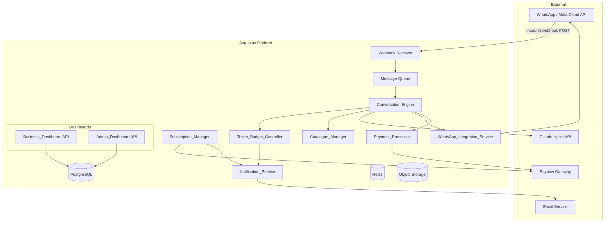
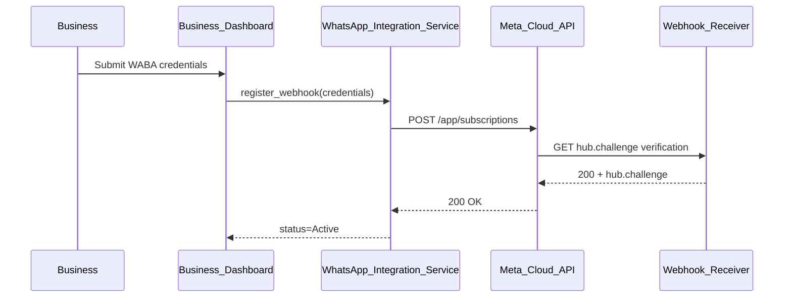
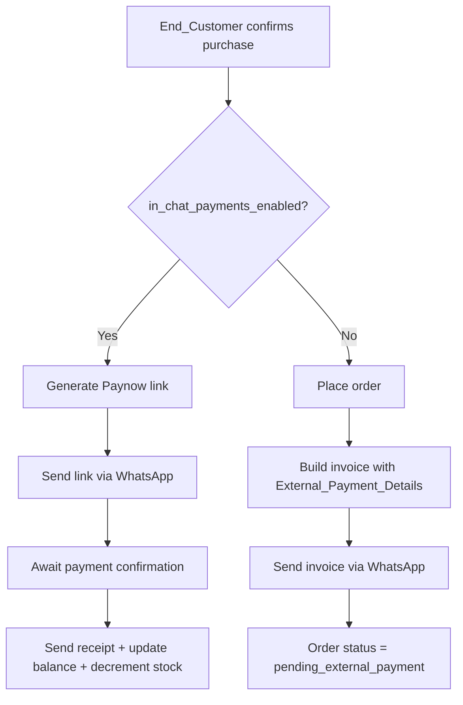

# Design Document: Augustus AI Sales Platform

## Overview

Augustus is a multi-tenant SaaS platform that deploys a goal-driven AI Sales Agent on each Business's existing WhatsApp Business number. The platform orchestrates three primary flows:

1. **Sales conversations** — End_Customers message a Business's WhatsApp number; the AI_Sales_Agent (Claude Haiku) responds, presents catalogue items, handles objections, and drives checkout via Paynow payment links.
2. **Business self-service** — Businesses register, pick a subscription tier, configure their catalogue and training data, and monitor performance through the Business_Dashboard.
3. **Platform operations** — Augustus operators monitor all tenants, manage API health, approve withdrawals, and enforce terms via the Admin_Dashboard.

The system is designed for high concurrency (many simultaneous WhatsApp conversations across many tenants), strict per-tenant cost isolation (Token_Budget_Controller), and zero-downtime webhook handling.

---

## Architecture

### High-Level System Diagram



### Deployment Model

- Containerised services deployed on a cloud provider.
- **PostgreSQL** as the primary relational store with row-level tenant isolation via `business_id` foreign keys.
- **Redis** for session tokens, conversation context cache, and distributed locks (preventing duplicate webhook processing).
- **Object Storage** (S3-compatible) for product images, training data files, CSV imports, and support attachments.
- **Message Queue** (Redis Streams or SQS) to decouple webhook ingestion from conversation processing, enabling horizontal scaling.

### Multi-Tenancy Model

Every tenant-scoped table carries a `business_id` column. Application middleware injects the authenticated `business_id` into every query. Tenant isolation is enforced at:

- Database query layer (mandatory `WHERE business_id = ?`)
- Token budget tracking (per-business monthly cost accumulator)
- WhatsApp credential storage (per-business encrypted secrets)
- Conversation context (per-business, per-end-customer Redis keys)

---

## Components and Interfaces

### 1. Webhook Receiver

Receives HTTP POST events from the Meta Cloud API.

- Validate `X-Hub-Signature-256` HMAC header.
- Acknowledge with HTTP 200 immediately (Meta requires < 5 s).
- Enqueue raw event payload to the Message Queue.
- Deduplicate using Meta message ID in Redis (TTL 24 h).

```
POST /webhooks/whatsapp/{business_id}
GET  /webhooks/whatsapp/{business_id}  (Meta hub.challenge verification)
```

### 2. Conversation Engine

Core orchestrator consuming events from the Message Queue.

- Load conversation context from Redis (up to 30 messages / 60 min window).
- Check Manual_Intervention status; if active, skip AI processing.
- Check Token_Budget_Controller; if budget exhausted, send unavailability message.
- Build goal-driven system prompt (business training data + catalogue context + sales directives).
- Call Claude Haiku API with assembled prompt and conversation history.
- Parse response for structured actions (carousel trigger, payment trigger).
- Dispatch outbound messages via WhatsApp_Integration_Service.
- Persist conversation turn to PostgreSQL and update Redis context.
- Record token usage against the business's monthly cost accumulator.

Session lifecycle: up to 30 messages OR 60 minutes. On expiry, summarise context and start fresh window.

### 3. Token_Budget_Controller

Enforces per-tier monthly Claude Haiku cost caps.

| Tier     | Monthly Cost Cap |
|----------|-----------------|
| Silver   | $A (configurable) |
| Gold     | $B (configurable) |
| Platinum | $C (configurable) |

- Maintains `monthly_cost_usd` accumulator per business in PostgreSQL (reset on billing cycle start).
- Atomically increments accumulator after each inference call.
- Evaluates thresholds: 80% → alert email, 95% → second alert, 100% → suspend AI responses.
- Exposes `check_budget(business_id) → {allowed, remaining_usd}` to Conversation Engine.
- Honours hard limit overrides from `business_token_overrides` table.

### 4. WhatsApp_Integration_Service

Manages Meta Cloud API credentials and outbound message dispatch.

- Stores per-business credentials (WABA ID, Phone Number ID, access token) encrypted at rest.
- Registers/deregisters webhooks with Meta Cloud API.
- Sends outbound messages: text, image, PDF, interactive carousel, quick-reply buttons, payment links.
- Enforces Meta's 16 MB media size limit; falls back to text description if exceeded.

Webhook registration sequence:


### 5. Catalogue_Manager

- CRUD for products (name, description, price, currency, stock_quantity, category, images).
- Out-of-stock enforcement: `stock_quantity = 0` products excluded from AI responses.
- Promotional combos: link ≥ 2 products with a combined promo price.
- CSV bulk import with row-level validation and error reporting.
- Revenue summary per product updated within 60 s of payment confirmation.
- Search/filter API for Business_Dashboard.

### 6. Payment_Processor

- On purchase confirmation, checks the Business's `in_chat_payments_enabled` flag:
  - **Enabled**: generates a Paynow payment link within 5 s and sends it to the End_Customer via WhatsApp.
  - **Disabled**: places the order, then sends an invoice message to the End_Customer containing order reference, items, total amount, and the Business's `external_payment_details`. No Paynow link is generated.
- Receives Paynow payment status via webhook or polling (only applicable when In_Chat_Payments is enabled).
- On Paynow confirmation: sends WhatsApp receipt, updates business revenue balance, triggers stock decrement.
- Expires payment links after 15 minutes; notifies End_Customer (only applicable when In_Chat_Payments is enabled).
- Processes withdrawal requests: validates balance, initiates Paynow payout within 24 h.
- Supports auto-processing of withdrawals below a configurable threshold.

**In_Chat_Payments branching logic:**


### 7. Subscription_Manager

- Activates subscriptions on successful Paynow payment.
- Schedules renewal reminders at T-7 days and T-1 day.
- Retries failed renewal payments after 24 h; suspends account on second failure.
- Handles upgrades (immediate) and downgrades (next cycle) with proration.

### 8. Business_Dashboard API

REST API backing the Business UI. All endpoints require a valid session token scoped to `business_id`.

Key endpoint groups: `/auth`, `/subscription`, `/integration`, `/catalogue`, `/training`, `/conversations`, `/orders`, `/payments`, `/support`, `/usage`.

### 9. Admin_Dashboard API

REST API backing the Admin UI. Requires MFA-authenticated operator session.

Key endpoint groups: `/businesses`, `/ai-usage`, `/whatsapp-usage`, `/subscriptions`, `/withdrawals`, `/api-keys`, `/audit-log`.

### 10. Notification_Service

Centralised email dispatch (subscription reminders, budget alerts, ticket updates, account events). Uses a transactional email provider (e.g., SendGrid / AWS SES).

---

## Data Models

### businesses
```sql
id              UUID PRIMARY KEY
name            TEXT NOT NULL
owner_name      TEXT NOT NULL
email           TEXT UNIQUE NOT NULL
password_hash   TEXT NOT NULL
email_verified  BOOLEAN DEFAULT FALSE
status          TEXT CHECK (status IN ('active','suspended','pending_verification'))
mfa_secret      TEXT  -- for admin accounts
in_chat_payments_enabled BOOLEAN NOT NULL DEFAULT TRUE
external_payment_details JSONB  -- required when in_chat_payments_enabled = FALSE
                                -- e.g. {"bank_account": "...", "ecocash_number": "...", "other": "..."}
                                -- at least one key must be non-null when toggle is disabled
created_at      TIMESTAMPTZ DEFAULT NOW()
```

### subscriptions
```sql
id              UUID PRIMARY KEY
business_id     UUID REFERENCES businesses(id)
tier            TEXT CHECK (tier IN ('silver','gold','platinum'))
price_usd       NUMERIC(10,2)
status          TEXT CHECK (status IN ('active','suspended','cancelled'))
activated_at    TIMESTAMPTZ
current_period_start TIMESTAMPTZ
current_period_end   TIMESTAMPTZ
paynow_reference     TEXT
created_at      TIMESTAMPTZ DEFAULT NOW()
```

### token_usage
```sql
id              UUID PRIMARY KEY
business_id     UUID REFERENCES businesses(id)
billing_cycle_start TIMESTAMPTZ
monthly_cost_usd    NUMERIC(10,4) DEFAULT 0
hard_limit_override_usd NUMERIC(10,4)  -- NULL = use tier default
alert_80_sent   BOOLEAN DEFAULT FALSE
alert_95_sent   BOOLEAN DEFAULT FALSE
suspended       BOOLEAN DEFAULT FALSE
updated_at      TIMESTAMPTZ
```

### whatsapp_integrations
```sql
id              UUID PRIMARY KEY
business_id     UUID REFERENCES businesses(id)
waba_id         TEXT NOT NULL
phone_number_id TEXT NOT NULL
access_token_encrypted TEXT NOT NULL
webhook_verify_token TEXT NOT NULL
status          TEXT CHECK (status IN ('active','inactive','error'))
error_message   TEXT
registered_at   TIMESTAMPTZ
updated_at      TIMESTAMPTZ
```

### products
```sql
id              UUID PRIMARY KEY
business_id     UUID REFERENCES businesses(id)
name            TEXT NOT NULL
description     TEXT
price           NUMERIC(10,2) NOT NULL
currency        TEXT NOT NULL DEFAULT 'USD'
stock_quantity  INTEGER NOT NULL DEFAULT 0
category        TEXT
image_urls      TEXT[]
is_active       BOOLEAN DEFAULT TRUE
created_at      TIMESTAMPTZ DEFAULT NOW()
updated_at      TIMESTAMPTZ
```

### promo_combos
```sql
id              UUID PRIMARY KEY
business_id     UUID REFERENCES businesses(id)
name            TEXT NOT NULL
promo_price     NUMERIC(10,2) NOT NULL
currency        TEXT NOT NULL
is_active       BOOLEAN DEFAULT TRUE
created_at      TIMESTAMPTZ DEFAULT NOW()
```

### promo_combo_products
```sql
combo_id    UUID REFERENCES promo_combos(id)
product_id  UUID REFERENCES products(id)
PRIMARY KEY (combo_id, product_id)
```

### conversations
```sql
id              UUID PRIMARY KEY
business_id     UUID REFERENCES businesses(id)
customer_wa_number TEXT NOT NULL
session_start   TIMESTAMPTZ NOT NULL
session_end     TIMESTAMPTZ
message_count   INTEGER DEFAULT 0
manual_intervention_active BOOLEAN DEFAULT FALSE
manual_agent_id UUID
intervention_start TIMESTAMPTZ
intervention_end   TIMESTAMPTZ
context_summary TEXT  -- stored on session expiry
status          TEXT CHECK (status IN ('active','closed'))
```

### messages
```sql
id              UUID PRIMARY KEY
conversation_id UUID REFERENCES conversations(id)
business_id     UUID REFERENCES businesses(id)
direction       TEXT CHECK (direction IN ('inbound','outbound'))
content_type    TEXT  -- text, image, carousel, quick_reply, payment_link
content         JSONB
meta_message_id TEXT UNIQUE
sent_at         TIMESTAMPTZ
```

### orders
```sql
id              UUID PRIMARY KEY
business_id     UUID REFERENCES businesses(id)
conversation_id UUID REFERENCES conversations(id)
customer_wa_number TEXT NOT NULL
order_reference TEXT UNIQUE NOT NULL
total_amount    NUMERIC(10,2) NOT NULL
currency        TEXT NOT NULL
status          TEXT CHECK (status IN ('pending','completed','expired','failed'))
paynow_link     TEXT
paynow_reference TEXT
created_at      TIMESTAMPTZ DEFAULT NOW()
completed_at    TIMESTAMPTZ
expires_at      TIMESTAMPTZ
```

### order_items
```sql
id          UUID PRIMARY KEY
order_id    UUID REFERENCES orders(id)
product_id  UUID REFERENCES products(id)
quantity    INTEGER NOT NULL
unit_price  NUMERIC(10,2) NOT NULL
```

### revenue_balances
```sql
business_id     UUID PRIMARY KEY REFERENCES businesses(id)
available_usd   NUMERIC(10,2) DEFAULT 0
lifetime_usd    NUMERIC(10,2) DEFAULT 0
updated_at      TIMESTAMPTZ
```

### withdrawal_requests
```sql
id              UUID PRIMARY KEY
business_id     UUID REFERENCES businesses(id)
amount_usd      NUMERIC(10,2) NOT NULL
status          TEXT CHECK (status IN ('pending','processed','failed'))
paynow_merchant_ref TEXT
paynow_payout_ref   TEXT
requested_at    TIMESTAMPTZ DEFAULT NOW()
processed_at    TIMESTAMPTZ
approved_by     UUID  -- operator id, NULL if auto-processed
```

### training_data
```sql
id              UUID PRIMARY KEY
business_id     UUID REFERENCES businesses(id)
business_description TEXT
faqs            TEXT
tone_guidelines TEXT
logo_url        TEXT
updated_at      TIMESTAMPTZ
```

### support_tickets
```sql
id              UUID PRIMARY KEY
business_id     UUID REFERENCES businesses(id)
reference       TEXT UNIQUE NOT NULL
subject         TEXT NOT NULL
description     TEXT NOT NULL
attachment_url  TEXT
status          TEXT CHECK (status IN ('open','in_progress','closed'))
created_at      TIMESTAMPTZ DEFAULT NOW()
updated_at      TIMESTAMPTZ
```

### operator_audit_log
```sql
id              UUID PRIMARY KEY
operator_id     UUID NOT NULL
action_type     TEXT NOT NULL
target_business_id UUID
metadata        JSONB
performed_at    TIMESTAMPTZ DEFAULT NOW()
```

---


## Correctness Properties

*A property is a characteristic or behavior that should hold true across all valid executions of a system — essentially, a formal statement about what the system should do. Properties serve as the bridge between human-readable specifications and machine-verifiable correctness guarantees.*

### Property 1: Password Validation Correctness

*For any* string submitted as a password, the validator should accept it if and only if it has at least 8 characters, contains at least one uppercase letter, at least one lowercase letter, and at least one digit — and reject all other strings.

**Validates: Requirements 1.2**

---

### Property 2: Duplicate Email Error Does Not Reveal Account Status

*For any* email address that is already registered in the system, the error response returned on a duplicate registration attempt must not contain the words "active", "suspended", or any other account status indicator.

**Validates: Requirements 1.3**

---

### Property 3: Session Token Lifetime Bound

*For any* successful login, the expiry timestamp on the issued session token must be no more than 24 hours after the issuance timestamp.

**Validates: Requirements 1.5**

---

### Property 4: Password Reset Token Validity Window

*For any* generated password reset token, it must be accepted as valid immediately after generation and must be rejected as expired after 60 minutes have elapsed.

**Validates: Requirements 1.7**

---

### Property 5: Subscription Activation State

*For any* business and any valid subscription plan, after a successful Paynow payment the subscription record must have status = "active" and a non-null activation timestamp.

**Validates: Requirements 2.2**

---

### Property 6: Plan Upgrade Applies Immediately

*For any* business upgrading from a lower tier to a higher tier, the new tier's cost cap and feature limits must be active immediately after the upgrade is processed, and the prorated charge must equal (days_remaining / days_in_cycle) × (new_price − old_price).

**Validates: Requirements 2.7**

---

### Property 7: Plan Downgrade Deferred to Next Cycle

*For any* business downgrading to a lower tier, the current cycle's limits must remain unchanged until the current billing period ends, at which point the new lower limits take effect.

**Validates: Requirements 2.8**

---

### Property 8: Tier Cost Cap Enforcement

*For any* business on any tier (Silver: $A, Gold: $B, Platinum: $C — all configurable by system admin), once the business's monthly accumulated Claude Haiku cost reaches or exceeds the tier cap, the Token_Budget_Controller must return `allowed = false` for all subsequent inference requests until the billing cycle resets.

**Validates: Requirements 3.1, 3.2, 3.3**

---

### Property 9: Budget Alert Thresholds

*For any* business, when their accumulated monthly cost first crosses 80% of their tier cap, exactly one alert email must be sent; when it first crosses 95%, exactly one additional alert email must be sent. No duplicate alerts should be sent for the same threshold crossing within the same billing cycle.

**Validates: Requirements 3.4, 3.5**

---

### Property 10: Budget Exhaustion Suspends AI Responses

*For any* business whose monthly cost has reached 100% of their tier cap, every subsequent call to `check_budget(business_id)` must return `allowed = false` until the billing cycle resets.

**Validates: Requirements 3.6**

---

### Property 11: Failed Webhook Verification Retains Credentials

*For any* WhatsApp credential submission where the Meta Cloud API webhook verification fails, the submitted credentials must be retained in the system (not cleared) and an error message must be returned to the caller.

**Validates: Requirements 4.3**

---

### Property 12: Re-integration Preserves Catalogue and Training Data

*For any* business that updates their WhatsApp credentials and re-triggers webhook registration, the count and content of their products and training data records must be identical before and after the re-integration.

**Validates: Requirements 4.5**

---

### Property 13: Claude Haiku Is the Only Inference Model

*For any* AI inference call made by the Conversation Engine, the `model` parameter in the Claude API request must be set to the Claude Haiku model identifier and no other model identifier.

**Validates: Requirements 5.3**

---

### Property 14: Session Context Window Boundary

*For any* conversation, the context passed to Claude Haiku must contain at most 30 messages and must not include messages older than 60 minutes from the current message timestamp.

**Validates: Requirements 5.6**

---

### Property 15: Manual Intervention Blocks AI Responses

*For any* conversation where `manual_intervention_active = true`, the Conversation Engine must not dispatch any outbound AI-generated message to that End_Customer.

**Validates: Requirements 5.8, 8.2**

---

### Property 16: Deactivating Manual Intervention Restores AI Responses

*For any* conversation where manual intervention is activated and then deactivated, the Conversation Engine must resume processing inbound messages and generating AI responses after deactivation.

**Validates: Requirements 8.4**

---

### Property 17: Manual Intervention Session Logging Completeness

*For any* manual intervention session, the log record must contain a non-null start time, a non-null end time (set on deactivation), and a non-null business agent identifier.

**Validates: Requirements 8.5**

---

### Property 18: Carousel Item Structure

*For any* Catalogue_Carousel message generated by the AI_Sales_Agent, every product item in the carousel must contain a product image URL, product name, price, and a Quick_Reply button with the label "View Details".

**Validates: Requirements 6.1**

---

### Property 19: Carousel Product Count Bounds

*For any* Catalogue_Carousel message, the number of product items must be at least 1 and at most 10.

**Validates: Requirements 6.2**

---

### Property 20: Media Size Fallback

*For any* media file whose size exceeds 16 MB, the WhatsApp_Integration_Service must send a text description of the item instead of the media file, and must not attempt to upload the oversized file to the Meta Cloud API.

**Validates: Requirements 6.5**

---

### Property 21: Payment Receipt Content Completeness

*For any* confirmed Paynow payment where In_Chat_Payments is enabled for the Business, the receipt message sent to the End_Customer must contain all four fields: order reference, items purchased, total amount, and timestamp.

**Validates: Requirements 7.2**

---

### Property 22: Payment Link Expiry State Transition

*For any* Paynow payment link that has not been completed within 15 minutes of generation, the order status must be set to "expired".

**Validates: Requirements 7.4**

---

### Property 23: Transaction Record Completeness

*For any* transaction recorded by the Payment_Processor, all five fields must be present and non-null: status, amount, currency, order_reference, and business_id.

**Validates: Requirements 7.5**

---

### Property 24: Stock Decrement on Payment Confirmation

*For any* confirmed Paynow payment containing a product with quantity Q, the product's stock_quantity after payment confirmation must equal its stock_quantity before confirmation minus Q.

**Validates: Requirements 7.6**

---

### Property 25: Out-of-Stock Products Excluded from Responses

*For any* product with stock_quantity = 0, it must not appear in any Catalogue_Carousel message or in any AI_Sales_Agent response, regardless of the End_Customer's query.

**Validates: Requirements 9.2**

---

### Property 26: Product Filter Correctness

*For any* combination of filters (name, category, price range, stock status) applied to the product catalogue, every product in the result set must satisfy all applied filter conditions, and no product satisfying all conditions must be absent from the result set.

**Validates: Requirements 9.3**

---

### Property 27: Active Combo Presented as Single Carousel Item

*For any* active promotional combo, when the AI_Sales_Agent presents it in a Catalogue_Carousel, it must appear as exactly one carousel item displaying the promotional price (not the sum of individual product prices).

**Validates: Requirements 9.5**

---

### Property 28: CSV Import Error Reporting

*For any* CSV import file containing rows with missing required fields, each such row must be skipped (not imported), and the error report returned to the Business must include the row number and the reason for each skipped row.

**Validates: Requirements 9.7**

---

### Property 29: Training Data File Size Rejection

*For any* file submitted as training data whose size exceeds 10 MB, the upload must be rejected with an error message that specifies the 10 MB size limit.

**Validates: Requirements 10.4**

---

### Property 30: WhatsApp Number Masking in Orders

*For any* order record displayed in the Business_Dashboard, the End_Customer's WhatsApp number must be masked such that only the last 4 digits are visible and all preceding digits are replaced with a masking character.

**Validates: Requirements 11.1**

---

### Property 31: Average Order Value Computation

*For any* set of completed orders, the displayed average order value must equal the total revenue divided by the total number of orders (within floating-point rounding tolerance).

**Validates: Requirements 11.3**

---

### Property 32: Orders CSV Export Round-Trip

*For any* set of orders in the system, the CSV export must contain one row per order with the same order reference, masked customer number, items, total amount, payment status, and timestamp as stored in the database.

**Validates: Requirements 11.4**

---

### Property 33: Withdrawal Amount Validation

*For any* withdrawal request where the requested amount exceeds the business's available revenue balance, the request must be rejected and the current available balance must be returned in the error response.

**Validates: Requirements 12.2, 12.3**

---

### Property 34: Support Ticket Attachment Size Limit

*For any* support ticket submission with an attachment whose size exceeds 5 MB, the submission must be rejected with an appropriate error message.

**Validates: Requirements 13.1**

---

### Property 35: Support Ticket Reference Uniqueness

*For any* two distinct support ticket submissions, their assigned ticket references must be different.

**Validates: Requirements 13.2**

---

### Property 36: Business Suspension Deactivates Services

*For any* business account that is suspended by an operator, both the AI_Sales_Agent (via Token_Budget_Controller suspension flag) and the WhatsApp_Integration_Service (integration status = inactive) must be deactivated immediately.

**Validates: Requirements 14.3**

---

### Property 37: Business Reactivation Restores Services

*For any* business account that is suspended and then reactivated by an operator, both the AI_Sales_Agent and the WhatsApp_Integration_Service must be restored to their prior active state.

**Validates: Requirements 14.4**

---

### Property 38: Platform-Wide Cost Alert at 90%

*For any* billing cycle, when the sum of all active businesses' monthly costs reaches 90% of the sum of all their tier caps, an alert notification must be dispatched to all operator accounts.

**Validates: Requirements 15.3**

---

### Property 39: Auto-Processing Threshold for Withdrawals

*For any* withdrawal request whose amount is strictly below the configured auto-processing threshold, the request must be processed automatically without requiring operator approval.

**Validates: Requirements 17.5**

---

### Property 40: No Paynow Link When In_Chat_Payments Disabled

*For any* order placed for a Business where `in_chat_payments_enabled = false`, the Payment_Processor must not generate a Paynow payment link, and the order record must have a null `paynow_link` field.

**Validates: Requirements 7.8, 18.4**

---

### Property 41: Invoice Content Completeness When In_Chat_Payments Disabled

*For any* order placed for a Business where `in_chat_payments_enabled = false`, the invoice message sent to the End_Customer must contain all four fields: order reference, items purchased, total amount, and at least one entry from the Business's `external_payment_details`.

**Validates: Requirements 7.7**

---

### Property 42: Disabling In_Chat_Payments Requires External_Payment_Details

*For any* attempt to set `in_chat_payments_enabled = false` for a Business, the operation must be rejected unless `external_payment_details` contains at least one non-null, non-empty payment reference (bank account number, EcoCash number, or other payment reference).

**Validates: Requirements 18.2, 18.3**

---

### Property 43: Toggle Change Applies Immediately to Subsequent Orders

*For any* Business whose `in_chat_payments_enabled` flag is changed, every order created after the change must be processed according to the new flag value — no order created after the toggle change may be processed under the previous setting.

**Validates: Requirements 18.4**

---

### Property 44: Payment Settings Round-Trip

*For any* Business that saves an `in_chat_payments_enabled` value and `external_payment_details`, reading back the payments settings page must return the exact same toggle state and the same stored `external_payment_details`.

**Validates: Requirements 18.5**

---

### Property 45: AI Agent Presents Invoice When In_Chat_Payments Disabled

*For any* purchase confirmation where `in_chat_payments_enabled = false`, the outbound WhatsApp message from the AI_Sales_Agent must reference the invoice generated by the Payment_Processor and must not contain a Paynow payment link URL.

**Validates: Requirements 18.6**

---

## Error Handling

### Webhook Processing Errors
- Invalid HMAC signature → return 403, do not enqueue.
- Duplicate message ID (already processed) → return 200 silently (idempotent).
- Malformed payload → log error, return 200 (prevent Meta retry storm), alert ops.
- Queue enqueue failure → return 500, Meta will retry.

### Claude Haiku API Errors
- Rate limit (429) → exponential backoff with jitter, max 3 retries; if all fail, send "temporarily unavailable" to End_Customer.
- Timeout → treat as rate limit, same retry logic.
- Model error (5xx) → same retry logic; log for ops monitoring.
- Budget exhausted → do not call API; send single unavailability message to End_Customer.

### Paynow Integration Errors
- Payment link generation failure → retry once; if still failing, notify End_Customer and log for ops.
- Payment status webhook not received → poll Paynow status endpoint at 1 min, 5 min, 15 min intervals.
- Payout failure → mark withdrawal as "failed", notify Business and operator.

### Meta Cloud API Errors
- Webhook registration failure → return descriptive error to Business_Dashboard, retain credentials.
- Message send failure → retry once after 2 s; if still failing, log and alert ops.
- Media upload failure (non-size-related) → fall back to text description.

### Data Validation Errors
- All API endpoints return structured JSON errors: `{ "error": "...", "field": "...", "code": "..." }`.
- HTTP 400 for validation errors, 401 for auth failures, 403 for authorization failures, 404 for not found, 409 for conflicts (duplicate email), 500 for internal errors.

### Account State Errors
- Suspended business attempts API call → 403 with `{ "code": "ACCOUNT_SUSPENDED" }`.
- Unverified email attempts login → 403 with `{ "code": "EMAIL_NOT_VERIFIED" }`.
- Locked account (5 failed logins) → 403 with `{ "code": "ACCOUNT_LOCKED", "unlock_at": "..." }`.

---

## Testing Strategy

### Dual Testing Approach

Both unit tests and property-based tests are required. They are complementary:
- **Unit tests** verify specific examples, integration points, and error conditions.
- **Property-based tests** verify universal properties across randomly generated inputs.

### Property-Based Testing

**Library selection by language:**
- TypeScript/JavaScript: `fast-check`
- Python: `hypothesis`
- Go: `gopter`
- Java/Kotlin: `jqwik`

**Configuration:**
- Minimum 100 iterations per property test.
- Each property test must be tagged with a comment referencing the design property.
- Tag format: `// Feature: augustus-ai-sales-platform, Property {N}: {property_title}`
- Each correctness property (Properties 1–45) must be implemented by exactly one property-based test.

**Generator guidance:**
- Generate arbitrary business records with random tier assignments for budget tests.
- Generate arbitrary strings for password validation tests (including edge cases: empty, all whitespace, all digits, all uppercase).
- Generate arbitrary product lists with random stock quantities for catalogue tests.
- Generate arbitrary CSV rows with random missing/present fields for import tests.
- Generate arbitrary conversation histories of varying lengths and ages for session tests.
- Generate arbitrary order sets for revenue computation tests.

### Unit Testing

Unit tests should focus on:
- Specific examples demonstrating correct behavior (e.g., exact plan prices, exact tier cap values).
- Integration points between components (e.g., Conversation Engine → Token_Budget_Controller → Claude API call chain).
- Error conditions and edge cases (e.g., exactly 5 failed logins triggers lockout, not 4 or 6).
- State machine transitions (e.g., subscription lifecycle: pending → active → suspended → reactivated).

Avoid writing unit tests that duplicate what property tests already cover across many inputs.

### Test Coverage Targets

| Component | Unit Tests | Property Tests |
|-----------|-----------|----------------|
| Token_Budget_Controller | Tier cap values, reset logic | Properties 8, 9, 10 |
| Conversation Engine | Session expiry example, manual intervention example | Properties 13, 14, 15, 16 |
| Catalogue_Manager | CRUD examples, CSV import examples | Properties 25, 26, 27, 28 |
| Payment_Processor | Payment flow examples, payout examples, invoice dispatch example | Properties 21, 22, 23, 24, 33, 40, 41, 43, 45 |
| WhatsApp_Integration_Service | Webhook registration flow | Properties 11, 12, 18, 19, 20 |
| Auth / Registration | Login lockout example, email verification example | Properties 1, 2, 3, 4 |
| Subscription_Manager | Upgrade/downgrade examples, reminder scheduling | Properties 5, 6, 7 |
| Business_Dashboard API | Orders display, CSV export, payment settings page | Properties 30, 31, 32, 42, 44 |
| Admin_Dashboard API | Suspension/reactivation examples | Properties 36, 37, 38 |
| Support | Ticket submission examples | Properties 34, 35 |
