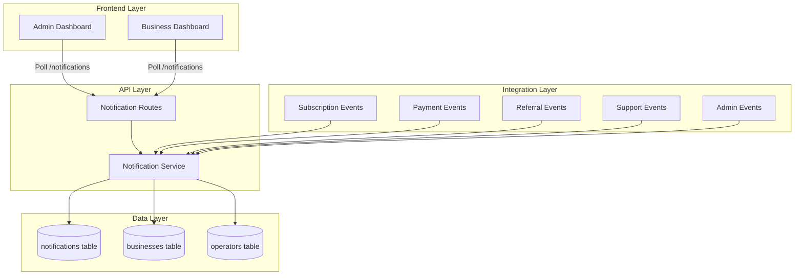

# Technical Design Document: In-App Notifications

## Overview

The in-app notification system provides real-time, persistent notifications to both admin operators and business users within their respective dashboards. This system extends the existing notification infrastructure (email via SendGrid/SES) by adding an in-app channel that delivers immediate, actionable alerts directly within the application interface.

### Key Features

- **Persistent Storage**: PostgreSQL-backed notification storage with full history
- **Dual Recipient Support**: Unified table supporting both admin operators and business users
- **Real-Time Updates**: Client-side polling mechanism for near-real-time notification delivery
- **Rich Notification Types**: 7 distinct notification categories covering all major system events
- **Read/Unread Tracking**: Full lifecycle management with read status and timestamps
- **Automatic Cleanup**: Scheduled retention policy (90 days) to manage database growth
- **RESTful API**: Complete CRUD operations with filtering and pagination

### Integration Points

The notification system integrates with existing modules:
- **Subscription Module**: Plan changes, renewals, payment events
- **Payment Module**: Order completions, refunds, withdrawals
- **Referral Module**: Commission earnings and milestones
- **Support Module**: Ticket creation, status changes, admin replies
- **Admin Module**: Business registration, account suspensions, system alerts

## Architecture

### System Components



### Data Flow

1. **Notification Creation**: System events trigger `createNotification()` service function
2. **Storage**: Notification record inserted into PostgreSQL with metadata
3. **Polling**: Frontend polls `/notifications/unread-count` every 30 seconds
4. **Retrieval**: User opens notification center, fetches `/notifications` with pagination
5. **Read Marking**: User clicks notification, PATCH `/notifications/:id/read` updates status
6. **Cleanup**: Daily cron job deletes notifications older than 90 days

### Authentication & Authorization

- All notification endpoints use existing JWT authentication middleware
- Business users can only access their own notifications (`recipient_type='business'` AND `recipient_id=businessId`)
- Admin operators can only access admin notifications (`recipient_type='admin'` AND `recipient_id=operatorId`)
- Row-level security enforced at service layer, not database RLS (to maintain consistency with existing patterns)

## Components and Interfaces

### Database Schema

#### Notifications Table

```sql
CREATE TABLE notifications (
  id                  UUID PRIMARY KEY DEFAULT gen_random_uuid(),
  recipient_type      VARCHAR(16) NOT NULL CHECK (recipient_type IN ('admin', 'business')),
  recipient_id        UUID NOT NULL,
  notification_type   VARCHAR(32) NOT NULL CHECK (notification_type IN (
    'account_change',
    'subscription_update',
    'payment_event',
    'referral_earning',
    'support_ticket',
    'system_alert',
    'order_update'
  )),
  title               VARCHAR(255) NOT NULL,
  message             TEXT NOT NULL,
  metadata            JSONB,
  is_read             BOOLEAN NOT NULL DEFAULT FALSE,
  read_at             TIMESTAMPTZ,
  created_at          TIMESTAMPTZ NOT NULL DEFAULT NOW(),
  updated_at          TIMESTAMPTZ NOT NULL DEFAULT NOW()
);

-- Indexes for efficient querying
CREATE INDEX idx_notifications_recipient ON notifications(recipient_type, recipient_id, created_at DESC);
CREATE INDEX idx_notifications_unread ON notifications(recipient_type, recipient_id, is_read) WHERE is_read = FALSE;
CREATE INDEX idx_notifications_cleanup ON notifications(created_at) WHERE created_at < NOW() - INTERVAL '90 days';
```

**Design Rationale**:
- `recipient_type` discriminator allows single table for both admin and business notifications
- `notification_type` enum ensures type safety and enables filtering
- `metadata` JSONB field provides flexibility for type-specific data (e.g., order IDs, ticket references)
- Composite index on `(recipient_type, recipient_id, created_at DESC)` optimizes the primary query pattern
- Partial index on unread notifications accelerates badge count queries
- Partial index on old records speeds up cleanup job

### API Endpoints

#### GET /notifications

Retrieve paginated notifications for authenticated user.

**Authentication**: Required (JWT)

**Query Parameters**:
- `limit` (optional, default: 20): Number of notifications to return
- `offset` (optional, default: 0): Pagination offset
- `type` (optional): Filter by notification_type
- `unread` (optional, boolean): Filter by read status

**Response** (200 OK):
```json
{
  "notifications": [
    {
      "id": "uuid",
      "type": "subscription_update",
      "title": "Subscription Renewed",
      "message": "Your Gold plan has been renewed for $49.99",
      "metadata": {
        "subscriptionId": "uuid",
        "planName": "Gold",
        "amount": 49.99
      },
      "isRead": false,
      "createdAt": "2025-01-15T10:30:00Z",
      "readAt": null
    }
  ],
  "total": 45,
  "hasMore": true
}
```

#### GET /notifications/unread-count

Get count of unread notifications for authenticated user.

**Authentication**: Required (JWT)

**Response** (200 OK):
```json
{
  "count": 5
}
```

#### PATCH /notifications/:id/read

Mark a single notification as read.

**Authentication**: Required (JWT)

**Response** (200 OK):
```json
{
  "id": "uuid",
  "isRead": true,
  "readAt": "2025-01-15T10:35:00Z"
}
```

**Error** (404 Not Found):
```json
{
  "error": "Notification not found"
}
```

#### POST /notifications/mark-all-read

Mark all unread notifications as read for authenticated user.

**Authentication**: Required (JWT)

**Response** (200 OK):
```json
{
  "markedCount": 5
}
```

### Service Layer

#### Notification Service (`notification.service.ts`)

**Core Functions**:

```typescript
// Create a new notification
async function createNotification(params: {
  recipientType: 'admin' | 'business';
  recipientId: string;
  notificationType: NotificationType;
  title: string;
  message: string;
  metadata?: Record<string, unknown>;
}): Promise<Notification>

// Get notifications for a user with pagination and filtering
async function getNotifications(params: {
  recipientType: 'admin' | 'business';
  recipientId: string;
  limit?: number;
  offset?: number;
  type?: NotificationType;
  unread?: boolean;
}): Promise<{ notifications: Notification[]; total: number; hasMore: boolean }>

// Get unread count for badge display
async function getUnreadCount(
  recipientType: 'admin' | 'business',
  recipientId: string
): Promise<number>

// Mark single notification as read
async function markAsRead(
  notificationId: string,
  recipientType: 'admin' | 'business',
  recipientId: string
): Promise<Notification>

// Mark all notifications as read
async function markAllAsRead(
  recipientType: 'admin' | 'business',
  recipientId: string
): Promise<number>

// Cleanup old notifications (called by scheduled job)
async function cleanupOldNotifications(): Promise<number>
```

**Type Definitions**:

```typescript
type NotificationType =
  | 'account_change'
  | 'subscription_update'
  | 'payment_event'
  | 'referral_earning'
  | 'support_ticket'
  | 'system_alert'
  | 'order_update';

interface Notification {
  id: string;
  recipientType: 'admin' | 'business';
  recipientId: string;
  notificationType: NotificationType;
  title: string;
  message: string;
  metadata?: Record<string, unknown>;
  isRead: boolean;
  readAt: Date | null;
  createdAt: Date;
  updatedAt: Date;
}
```

### Integration Helpers

Helper functions to be called from existing modules:

```typescript
// Subscription module integration
async function notifySubscriptionUpdate(
  businessId: string,
  event: 'upgraded' | 'downgraded' | 'renewed' | 'cancelled' | 'payment_failed',
  details: { planName?: string; amount?: number; renewalDate?: Date }
): Promise<void>

// Payment module integration
async function notifyPaymentEvent(
  businessId: string,
  event: 'order_completed' | 'refund_processed' | 'withdrawal_approved' | 'withdrawal_rejected',
  details: { amount: number; reference?: string; reason?: string }
): Promise<void>

// Referral module integration
async function notifyReferralEarning(
  businessId: string,
  event: 'commission_earned' | 'commission_credited',
  details: { amount: number; referredBusinessName?: string; walletBalance?: number }
): Promise<void>

// Support module integration
async function notifySupportTicket(
  recipientType: 'admin' | 'business',
  recipientId: string,
  event: 'created' | 'status_changed' | 'admin_replied' | 'resolved',
  details: { ticketReference: string; subject?: string; status?: string; preview?: string }
): Promise<void>

// Admin module integration
async function notifyAdminEvent(
  event: 'business_registered' | 'account_suspended' | 'withdrawal_requested' | 'payment_failed_final',
  details: { businessName: string; businessId?: string; amount?: number; reason?: string }
): Promise<void>
```

## Data Models

### Notification Entity

| Field | Type | Constraints | Description |
|-------|------|-------------|-------------|
| id | UUID | PRIMARY KEY | Unique notification identifier |
| recipient_type | VARCHAR(16) | NOT NULL, CHECK | 'admin' or 'business' |
| recipient_id | UUID | NOT NULL | Foreign key to businesses or operators |
| notification_type | VARCHAR(32) | NOT NULL, CHECK | One of 7 defined types |
| title | VARCHAR(255) | NOT NULL | Short notification title |
| message | TEXT | NOT NULL | Full notification message |
| metadata | JSONB | NULLABLE | Type-specific structured data |
| is_read | BOOLEAN | NOT NULL, DEFAULT FALSE | Read status flag |
| read_at | TIMESTAMPTZ | NULLABLE | Timestamp when marked as read |
| created_at | TIMESTAMPTZ | NOT NULL, DEFAULT NOW() | Creation timestamp |
| updated_at | TIMESTAMPTZ | NOT NULL, DEFAULT NOW() | Last update timestamp |

### Notification Types and Use Cases

| Type | Recipient | Trigger Events | Example Title |
|------|-----------|----------------|---------------|
| account_change | Business | Account suspended, reactivated | "Account Suspended" |
| subscription_update | Business | Plan change, renewal, cancellation | "Subscription Renewed" |
| payment_event | Business | Order payment, refund, withdrawal | "Payment Received" |
| referral_earning | Business | Commission earned, credited | "Referral Commission Earned" |
| support_ticket | Both | Ticket created, status change, reply | "Support Ticket Updated" |
| system_alert | Both | Critical system events, maintenance | "System Maintenance Scheduled" |
| order_update | Business | Order status changes | "Order Shipped" |

## Error Handling

### Service Layer Error Handling

```typescript
// Validation errors
if (!recipientId || !title || !message) {
  throw new Error('Missing required notification fields');
}

// Database errors
try {
  const result = await pool.query(/* ... */);
} catch (err) {
  console.error('[Notification] Database error:', err);
  throw new Error('Failed to create notification');
}

// Authorization errors
if (notification.recipientId !== requestingUserId) {
  throw new Error('Unauthorized access to notification');
}
```

### API Error Responses

| Status Code | Scenario | Response Body |
|-------------|----------|---------------|
| 400 | Invalid request parameters | `{ "error": "Invalid notification type" }` |
| 401 | Missing or invalid JWT | `{ "error": "Unauthorized" }` |
| 404 | Notification not found | `{ "error": "Notification not found" }` |
| 500 | Database or server error | `{ "error": "Internal server error" }` |

### Frontend Error Handling

- **Network Errors**: Display toast notification "Failed to load notifications. Please try again."
- **Polling Failures**: Silently retry after 60 seconds (double the normal interval)
- **Mark Read Failures**: Optimistically update UI, revert on error with toast notification

## Testing Strategy

### Unit Tests

**Service Layer Tests** (`notification.service.test.ts`):
- Test `createNotification()` with valid and invalid inputs
- Test `getNotifications()` pagination and filtering
- Test `getUnreadCount()` accuracy
- Test `markAsRead()` authorization checks
- Test `markAllAsRead()` batch operations
- Test `cleanupOldNotifications()` date filtering

**Integration Helper Tests** (`notification.helpers.test.ts`):
- Test each helper function creates correct notification type
- Test metadata structure for each notification type
- Test error handling when recipient doesn't exist

### Integration Tests

**API Endpoint Tests** (`notification.routes.test.ts`):
- Test GET /notifications with various filters
- Test GET /notifications/unread-count accuracy
- Test PATCH /notifications/:id/read authorization
- Test POST /notifications/mark-all-read batch operation
- Test authentication middleware enforcement
- Test cross-user authorization (business A cannot read business B's notifications)

**Database Tests** (`notification.db.test.ts`):
- Test index performance on large datasets
- Test cleanup job performance
- Test concurrent read/write operations

### End-to-End Tests

**Frontend Integration Tests**:
- Test notification badge updates after polling
- Test notification center displays correct data
- Test mark as read updates badge count
- Test mark all as read clears badge
- Test notification click navigation (if applicable)

**Cross-Module Integration Tests**:
- Test subscription renewal creates notification
- Test payment completion creates notification
- Test referral commission creates notification
- Test support ticket reply creates notification
- Test admin events create notifications

### Property-Based Testing

This feature is **not suitable for property-based testing** because:
1. **Infrastructure Integration**: The notification system primarily integrates with database operations and external modules, not pure transformation logic
2. **Side-Effect Heavy**: Core operations involve database writes, not pure functions with universal properties
3. **Event-Driven**: Notifications are triggered by specific system events, not general input transformations

**Alternative Testing Approach**:
- **Example-based unit tests**: Cover specific notification creation scenarios
- **Integration tests**: Verify database operations and API endpoints
- **Mock-based tests**: Test integration points with other modules

## Frontend Components

### NotificationBadge Component

**Location**: `packages/admin-dashboard/src/components/NotificationBadge.tsx` and `packages/business-dashboard/src/components/NotificationBadge.tsx`

**Props**:
```typescript
interface NotificationBadgeProps {
  count: number;
  onClick: () => void;
}
```

**Behavior**:
- Display count if > 0
- Display "99+" if count > 99
- Hide badge if count === 0
- Animate on count increase (pulse effect)
- Poll `/notifications/unread-count` every 30 seconds

**Implementation**:
```tsx
const NotificationBadge: React.FC<NotificationBadgeProps> = ({ count, onClick }) => {
  const displayCount = count > 99 ? '99+' : count.toString();
  const shouldShow = count > 0;

  return (
    <button onClick={onClick} className="notification-badge-button">
      <BellIcon />
      {shouldShow && (
        <span className="badge">{displayCount}</span>
      )}
    </button>
  );
};
```

### NotificationCenter Component

**Location**: `packages/admin-dashboard/src/components/NotificationCenter.tsx` and `packages/business-dashboard/src/components/NotificationCenter.tsx`

**Props**:
```typescript
interface NotificationCenterProps {
  isOpen: boolean;
  onClose: () => void;
}
```

**Features**:
- Dropdown panel with max height and scroll
- Display 20 most recent notifications
- Visual distinction between read/unread (bold title, blue dot)
- Relative timestamps ("5 minutes ago", "2 hours ago", "yesterday")
- "Mark all as read" button
- "View All" link to full-page history
- Empty state message when no notifications

**Implementation**:
```tsx
const NotificationCenter: React.FC<NotificationCenterProps> = ({ isOpen, onClose }) => {
  const [notifications, setNotifications] = useState<Notification[]>([]);
  const [loading, setLoading] = useState(false);

  useEffect(() => {
    if (isOpen) {
      fetchNotifications();
    }
  }, [isOpen]);

  const fetchNotifications = async () => {
    setLoading(true);
    try {
      const response = await api.get('/notifications?limit=20');
      setNotifications(response.data.notifications);
    } catch (err) {
      console.error('Failed to fetch notifications:', err);
    } finally {
      setLoading(false);
    }
  };

  const handleMarkAsRead = async (id: string) => {
    try {
      await api.patch(`/notifications/${id}/read`);
      setNotifications(prev =>
        prev.map(n => n.id === id ? { ...n, isRead: true } : n)
      );
    } catch (err) {
      console.error('Failed to mark as read:', err);
    }
  };

  const handleMarkAllAsRead = async () => {
    try {
      await api.post('/notifications/mark-all-read');
      setNotifications(prev => prev.map(n => ({ ...n, isRead: true })));
    } catch (err) {
      console.error('Failed to mark all as read:', err);
    }
  };

  if (!isOpen) return null;

  return (
    <div className="notification-center-dropdown">
      <div className="header">
        <h3>Notifications</h3>
        <button onClick={handleMarkAllAsRead}>Mark all as read</button>
      </div>
      <div className="notification-list">
        {loading ? (
          <div className="loading">Loading...</div>
        ) : notifications.length === 0 ? (
          <div className="empty-state">No notifications</div>
        ) : (
          notifications.map(notification => (
            <NotificationItem
              key={notification.id}
              notification={notification}
              onClick={() => handleMarkAsRead(notification.id)}
            />
          ))
        )}
      </div>
      <div className="footer">
        <a href="/notifications">View All</a>
      </div>
    </div>
  );
};
```

### NotificationItem Component

**Props**:
```typescript
interface NotificationItemProps {
  notification: Notification;
  onClick: () => void;
}
```

**Features**:
- Display notification type icon
- Display title (bold if unread)
- Display message preview (truncated to 100 chars)
- Display relative timestamp
- Blue dot indicator for unread
- Click handler to mark as read

### NotificationHistoryPage Component

**Location**: `packages/admin-dashboard/src/pages/NotificationHistory.tsx` and `packages/business-dashboard/src/pages/NotificationHistory.tsx`

**Features**:
- Full-page view with pagination
- Filter by notification type
- Filter by read/unread status
- Infinite scroll or "Load More" button
- Same NotificationItem component for consistency

## Scheduled Jobs

### Cleanup Job

**Schedule**: Daily at midnight UTC (cron: `0 0 * * *`)

**Implementation**: Add to existing job runner or create new scheduled task

```typescript
// In packages/api/src/jobs/notification-cleanup.ts
import { cleanupOldNotifications } from '../modules/notification/notification.service.js';

export async function runNotificationCleanup(): Promise<void> {
  console.log('[Job] Starting notification cleanup...');
  try {
    const deletedCount = await cleanupOldNotifications();
    console.log(`[Job] Notification cleanup complete. Deleted ${deletedCount} notifications.`);
  } catch (err) {
    console.error('[Job] Notification cleanup failed:', err);
  }
}
```

**Registration**: Add to main job scheduler

```typescript
// In packages/api/src/jobs/index.ts
import { runNotificationCleanup } from './notification-cleanup.js';

schedule.scheduleJob('0 0 * * *', runNotificationCleanup);
```

## Deployment Considerations

### Database Migration

**Migration File**: `026_in_app_notifications.sql`

**Rollback Strategy**:
```sql
-- Rollback script
DROP INDEX IF EXISTS idx_notifications_cleanup;
DROP INDEX IF EXISTS idx_notifications_unread;
DROP INDEX IF EXISTS idx_notifications_recipient;
DROP TABLE IF EXISTS notifications;
```

### Performance Considerations

**Expected Load**:
- Average: 100-500 notifications/day per business
- Peak: 1000 notifications/day during high activity
- Total: ~50,000 notifications/day across 100 businesses

**Index Strategy**:
- Primary query pattern: `(recipient_type, recipient_id, created_at DESC)` - covered by composite index
- Unread count query: `(recipient_type, recipient_id, is_read)` - covered by partial index
- Cleanup query: `created_at` - covered by partial index

**Query Performance Targets**:
- GET /notifications: < 100ms (p95)
- GET /notifications/unread-count: < 50ms (p95)
- PATCH /notifications/:id/read: < 50ms (p95)
- POST /notifications/mark-all-read: < 200ms (p95)

### Monitoring

**Metrics to Track**:
- Notification creation rate (per type)
- Unread notification count (per user)
- API endpoint latency (p50, p95, p99)
- Polling frequency and success rate
- Cleanup job execution time and deleted count

**Alerts**:
- Notification creation failures > 1% error rate
- API endpoint latency > 500ms (p95)
- Cleanup job failures
- Database table size > 10GB (indicates cleanup issues)

## Security Considerations

### Authentication

- All endpoints require valid JWT token
- Token must contain `businessId` (for business users) or `operatorId` (for admin users)
- Middleware extracts user identity from token

### Authorization

- Business users can only access notifications where `recipient_type='business'` AND `recipient_id=businessId`
- Admin operators can only access notifications where `recipient_type='admin'` AND `recipient_id=operatorId`
- Service layer enforces authorization checks before database queries
- No cross-user data leakage possible

### Input Validation

- Notification type must be one of 7 defined enum values
- Title max length: 255 characters
- Message max length: 10,000 characters (TEXT field)
- Metadata must be valid JSON (enforced by JSONB type)
- Pagination limits: max 100 notifications per request

### Rate Limiting

- Polling endpoint: max 2 requests/minute per user (existing rate limiter)
- Mark all as read: max 5 requests/minute per user (prevent abuse)
- Create notification: internal only, no rate limiting needed

## Future Enhancements

### Phase 2 Features (Not in Current Scope)

1. **WebSocket Support**: Replace polling with WebSocket for true real-time updates
2. **Push Notifications**: Browser push notifications for critical alerts
3. **Notification Preferences**: User-configurable notification settings per type
4. **Notification Actions**: Inline actions (e.g., "Approve Withdrawal" button)
5. **Notification Grouping**: Group related notifications (e.g., "5 new orders")
6. **Rich Media**: Support for images, links, and formatted content
7. **Notification Search**: Full-text search across notification history
8. **Export**: CSV export of notification history
9. **Notification Templates**: Configurable templates for each notification type
10. **Multi-language Support**: Localized notification messages

### Technical Debt Considerations

- Current polling approach is simple but not scalable to 1000+ concurrent users
- Consider WebSocket migration when user base exceeds 500 active users
- Monitor database table growth and adjust retention policy if needed
- Consider archiving old notifications to separate table instead of deletion

## Appendix

### Notification Type Examples

#### account_change
```json
{
  "title": "Account Suspended",
  "message": "Your account has been suspended due to failed payment. Please update your payment method.",
  "metadata": {
    "reason": "payment_failure",
    "suspendedAt": "2025-01-15T10:00:00Z"
  }
}
```

#### subscription_update
```json
{
  "title": "Subscription Renewed",
  "message": "Your Gold plan has been renewed for $49.99. Next renewal: Feb 15, 2025.",
  "metadata": {
    "subscriptionId": "uuid",
    "planName": "Gold",
    "amount": 49.99,
    "renewalDate": "2025-02-15"
  }
}
```

#### payment_event
```json
{
  "title": "Payment Received",
  "message": "Payment of $125.50 received for order #ORD-12345",
  "metadata": {
    "orderId": "uuid",
    "orderReference": "ORD-12345",
    "amount": 125.50,
    "currency": "USD"
  }
}
```

#### referral_earning
```json
{
  "title": "Referral Commission Earned",
  "message": "You earned $4.99 commission from TechCorp's subscription payment",
  "metadata": {
    "referralId": "uuid",
    "referredBusinessName": "TechCorp",
    "commissionAmount": 4.99,
    "subscriptionAmount": 49.99
  }
}
```

#### support_ticket
```json
{
  "title": "Support Ticket Reply",
  "message": "Admin replied to your ticket [TKT-ABC123]: 'We've reviewed your request...'",
  "metadata": {
    "ticketId": "uuid",
    "ticketReference": "TKT-ABC123",
    "replyPreview": "We've reviewed your request...",
    "repliedBy": "Admin"
  }
}
```

#### system_alert
```json
{
  "title": "System Maintenance Scheduled",
  "message": "Scheduled maintenance on Jan 20, 2025 from 2:00 AM - 4:00 AM UTC. Services will be unavailable.",
  "metadata": {
    "maintenanceStart": "2025-01-20T02:00:00Z",
    "maintenanceEnd": "2025-01-20T04:00:00Z",
    "affectedServices": ["API", "Dashboard"]
  }
}
```

#### order_update
```json
{
  "title": "Order Shipped",
  "message": "Your order #ORD-12345 has been shipped. Tracking: TRK-XYZ789",
  "metadata": {
    "orderId": "uuid",
    "orderReference": "ORD-12345",
    "status": "shipped",
    "trackingNumber": "TRK-XYZ789"
  }
}
```

### API Request/Response Examples

#### GET /notifications

**Request**:
```http
GET /notifications?limit=20&offset=0&unread=true HTTP/1.1
Authorization: Bearer <jwt_token>
```

**Response**:
```json
{
  "notifications": [
    {
      "id": "550e8400-e29b-41d4-a716-446655440000",
      "type": "subscription_update",
      "title": "Subscription Renewed",
      "message": "Your Gold plan has been renewed for $49.99",
      "metadata": {
        "subscriptionId": "uuid",
        "planName": "Gold",
        "amount": 49.99
      },
      "isRead": false,
      "createdAt": "2025-01-15T10:30:00Z",
      "readAt": null
    }
  ],
  "total": 5,
  "hasMore": false
}
```

#### GET /notifications/unread-count

**Request**:
```http
GET /notifications/unread-count HTTP/1.1
Authorization: Bearer <jwt_token>
```

**Response**:
```json
{
  "count": 5
}
```

#### PATCH /notifications/:id/read

**Request**:
```http
PATCH /notifications/550e8400-e29b-41d4-a716-446655440000/read HTTP/1.1
Authorization: Bearer <jwt_token>
```

**Response**:
```json
{
  "id": "550e8400-e29b-41d4-a716-446655440000",
  "isRead": true,
  "readAt": "2025-01-15T10:35:00Z"
}
```

#### POST /notifications/mark-all-read

**Request**:
```http
POST /notifications/mark-all-read HTTP/1.1
Authorization: Bearer <jwt_token>
```

**Response**:
```json
{
  "markedCount": 5
}
```
