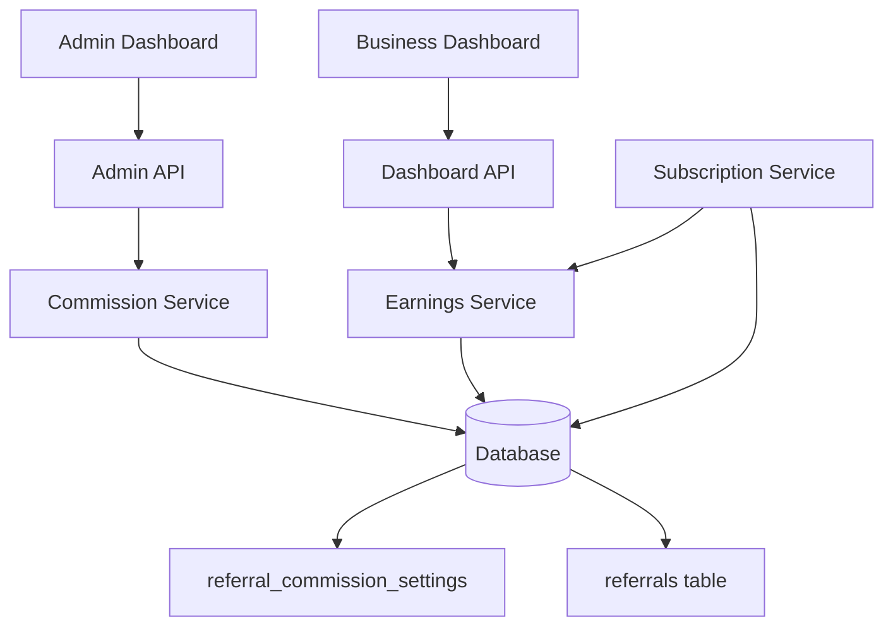
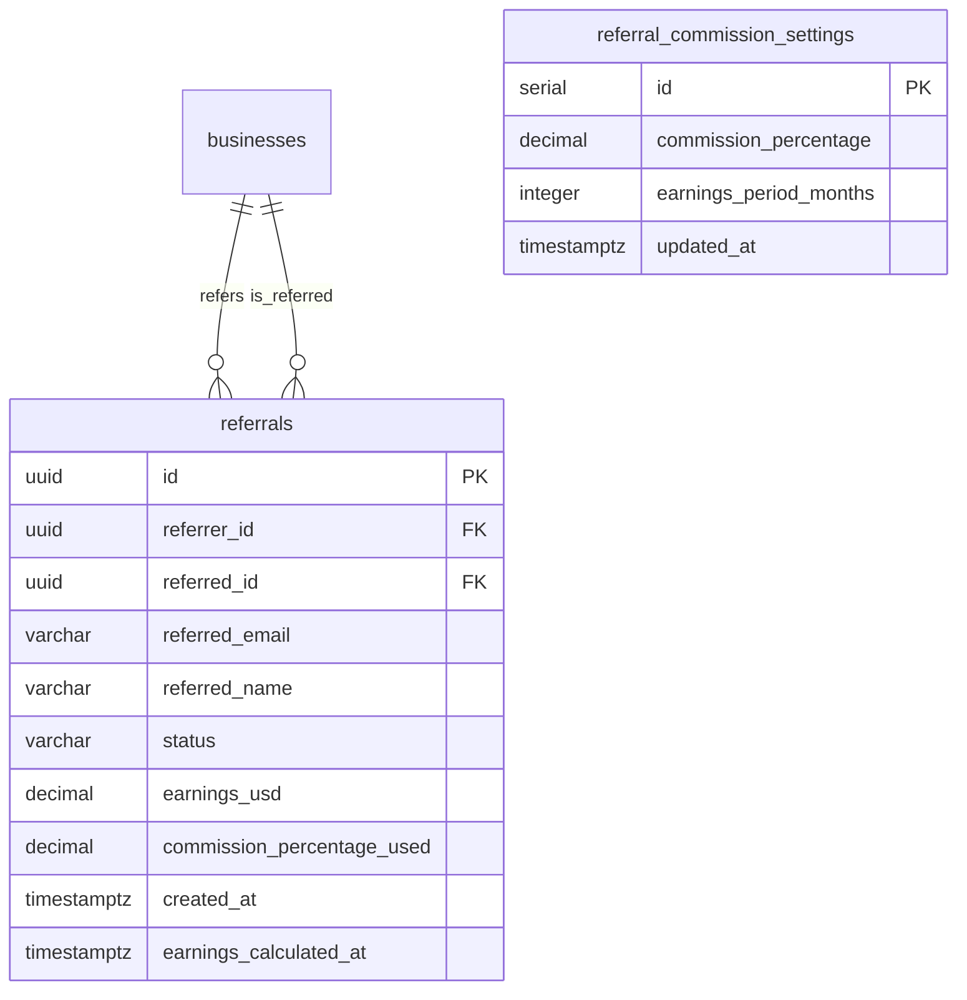

# Design Document: Referral Commission Earnings

## Overview

This design extends the existing referral system to support configurable commission percentages, earnings tracking, and time-based earnings validity. The system enables administrators to configure referral incentives while providing businesses with transparent earnings tracking for their successful referrals.

### Key Design Goals

1. **Flexible Configuration**: Admin-controlled commission percentage and earnings validity period
2. **Accurate Earnings Calculation**: Precise decimal handling for commission calculations based on subscription prices
3. **Time-Based Validity**: Earnings expire after a configurable period to reflect current referral activity
4. **Data Integrity**: Immutable earnings records with proper foreign key constraints
5. **Backward Compatibility**: Extends existing referral system without breaking current functionality

### Integration Points

- **Database**: New `referral_commission_settings` table and additional columns in `referrals` table
- **Admin API**: New endpoints for commission configuration and earnings overview
- **Dashboard API**: New endpoint for business earnings retrieval
- **Subscription Service**: Hook into `activateSubscription` to calculate and store earnings
- **Registration Flow**: No changes required (already tracks referrals)

## Architecture

### System Components



### Data Flow

**Commission Configuration Flow:**
1. Admin updates commission percentage or earnings period via Admin API
2. Commission Service validates input (0-100 for percentage, positive integer for period)
3. Settings stored in `referral_commission_settings` table
4. Future earnings calculations use new settings

**Earnings Calculation Flow:**
1. Referred business activates subscription
2. Subscription Service calls Earnings Service
3. Earnings Service retrieves current commission settings
4. Calculates earnings: `subscription_price * (commission_percentage / 100)`
5. Updates referral record with earnings, commission percentage used, and timestamp
6. Referral status updated from 'registered' to 'subscribed'

**Earnings Retrieval Flow:**
1. Business or Admin requests earnings data
2. Earnings Service queries referrals table
3. Filters records by earnings period (created_at within configured months)
4. Sums earnings and returns aggregated data

## Components and Interfaces

### Database Schema

#### New Table: referral_commission_settings

```sql
CREATE TABLE referral_commission_settings (
  id                    SERIAL PRIMARY KEY,
  commission_percentage DECIMAL(5,2) NOT NULL DEFAULT 10.00 
                        CHECK (commission_percentage >= 0 AND commission_percentage <= 100),
  earnings_period_months INTEGER NOT NULL DEFAULT 12 
                        CHECK (earnings_period_months > 0),
  updated_at            TIMESTAMPTZ NOT NULL DEFAULT NOW()
);

-- Seed default values
INSERT INTO referral_commission_settings (commission_percentage, earnings_period_months)
VALUES (10.00, 12);
```

**Design Rationale:**
- Single-row table (enforced by application logic) for system-wide settings
- `DECIMAL(5,2)` allows percentages from 0.00 to 100.00 with 2 decimal precision
- Check constraints enforce valid ranges at database level
- Default values: 10% commission, 12-month validity period

#### Modified Table: referrals

```sql
ALTER TABLE referrals
  ADD COLUMN earnings_usd              DECIMAL(10,2),
  ADD COLUMN commission_percentage_used DECIMAL(5,2),
  ADD COLUMN earnings_calculated_at    TIMESTAMPTZ;

CREATE INDEX idx_referrals_created_at ON referrals(created_at);
CREATE INDEX idx_referrals_status ON referrals(status);
```

**Design Rationale:**
- `earnings_usd`: DECIMAL(10,2) supports up to $99,999,999.99 with 2 decimal precision
- `commission_percentage_used`: Stores the percentage applied at calculation time (immutable)
- `earnings_calculated_at`: Timestamp when earnings were calculated
- Indexes on `created_at` and `status` optimize earnings queries
- Nullable columns maintain backward compatibility with existing referral records

### API Endpoints

#### Admin API

**POST /admin/referral-commission/settings**
- **Purpose**: Update commission percentage and/or earnings period
- **Authentication**: Operator token required
- **Request Body**:
  ```typescript
  {
    commissionPercentage?: number;  // 0-100
    earningsPeriodMonths?: number;  // positive integer
  }
  ```
- **Response**:
  ```typescript
  {
    commissionPercentage: number;
    earningsPeriodMonths: number;
    updatedAt: string;
  }
  ```
- **Validation**:
  - `commissionPercentage`: 0 ≤ value ≤ 100
  - `earningsPeriodMonths`: value > 0
- **Error Codes**: 400 (validation), 401 (unauthorized), 500 (server error)

**GET /admin/referral-commission/settings**
- **Purpose**: Retrieve current commission settings
- **Authentication**: Operator token required
- **Response**:
  ```typescript
  {
    commissionPercentage: number;
    earningsPeriodMonths: number;
    updatedAt: string;
  }
  ```

**GET /admin/businesses/:id/earnings**
- **Purpose**: View referral earnings for a specific business
- **Authentication**: Operator token required
- **Response**:
  ```typescript
  {
    businessId: string;
    businessName: string;
    totalEarningsUsd: number;      // sum of valid earnings
    validReferralsCount: number;   // count within earnings period
    referrals: Array<{
      id: string;
      referredEmail: string;
      referredName: string;
      status: 'registered' | 'subscribed';
      earningsUsd: number | null;
      commissionPercentageUsed: number | null;
      createdAt: string;
      earningsCalculatedAt: string | null;
    }>;
  }
  ```

**GET /admin/referral-commission/system-stats**
- **Purpose**: System-wide referral earnings statistics
- **Authentication**: Operator token required
- **Response**:
  ```typescript
  {
    totalEarningsUsd: number;           // sum across all businesses
    totalValidReferrals: number;        // count within earnings period
    totalSubscribedReferrals: number;   // count with status='subscribed'
    averageEarningsPerReferral: number; // totalEarnings / totalSubscribed
  }
  ```

#### Dashboard API

**GET /dashboard/referrals/earnings**
- **Purpose**: Retrieve earnings for authenticated business
- **Authentication**: Business JWT token required
- **Response**:
  ```typescript
  {
    totalEarningsUsd: number;
    validReferralsCount: number;
    referrals: Array<{
      id: string;
      referredEmail: string;
      referredName: string;
      status: 'registered' | 'subscribed';
      earningsUsd: number | null;
      createdAt: string;
      earningsCalculatedAt: string | null;
    }>;
  }
  ```
- **Note**: Does not expose `commissionPercentageUsed` to businesses

### Service Layer

#### CommissionService

**Purpose**: Manage commission settings configuration

```typescript
interface CommissionSettings {
  commissionPercentage: number;
  earningsPeriodMonths: number;
  updatedAt: Date;
}

class CommissionService {
  async getSettings(): Promise<CommissionSettings>;
  
  async updateSettings(
    commissionPercentage?: number,
    earningsPeriodMonths?: number
  ): Promise<CommissionSettings>;
  
  private validatePercentage(value: number): void;
  private validatePeriod(value: number): void;
}
```

**Implementation Notes:**
- Single-row table pattern: always UPDATE id=1, never INSERT additional rows
- Validation throws errors with 400 status codes
- Returns updated settings after successful update

#### EarningsService

**Purpose**: Calculate and retrieve referral earnings

```typescript
interface ReferralEarnings {
  referralId: string;
  earningsUsd: number;
  commissionPercentageUsed: number;
  calculatedAt: Date;
}

class EarningsService {
  async calculateEarnings(
    referralId: string,
    subscriptionPriceUsd: number
  ): Promise<ReferralEarnings>;
  
  async getBusinessEarnings(
    businessId: string
  ): Promise<{
    totalEarningsUsd: number;
    validReferralsCount: number;
    referrals: ReferralWithEarnings[];
  }>;
  
  async getSystemStats(): Promise<SystemEarningsStats>;
  
  private isWithinEarningsPeriod(
    createdAt: Date,
    periodMonths: number
  ): boolean;
}
```

**Key Methods:**

**calculateEarnings:**
- Retrieves current commission settings
- Calculates: `earnings = subscriptionPriceUsd * (commissionPercentage / 100)`
- Rounds to 2 decimal places using `DECIMAL(10,2)` database type
- Updates referral record with earnings, percentage used, and timestamp
- Returns calculated earnings data

**getBusinessEarnings:**
- Queries referrals where `referrer_id = businessId`
- Retrieves current earnings period from settings
- Filters referrals where `created_at >= NOW() - INTERVAL 'X months'`
- Sums `earnings_usd` for valid referrals
- Returns aggregated data with individual referral details

**isWithinEarningsPeriod:**
- Compares `referral.created_at` against current date minus earnings period
- Returns boolean indicating if referral is within valid period

### Integration with Subscription Service

**Modification to activateSubscription:**

```typescript
export async function activateSubscription(
  businessId: string,
  tier: PlanTier,
  paynowReference: string,
  billingMonths = 1,
): Promise<Subscription> {
  // ... existing code ...
  
  await client.query('BEGIN');
  
  try {
    // ... existing subscription activation logic ...
    
    // Check if this business was referred
    const referralResult = await client.query<{ id: string; referrer_id: string }>(
      `SELECT id, referrer_id FROM referrals 
       WHERE referred_id = $1 AND status = 'registered'`,
      [businessId]
    );
    
    if (referralResult.rows.length > 0) {
      const referral = referralResult.rows[0];
      
      // Calculate earnings
      const earnings = await earningsService.calculateEarnings(
        referral.id,
        plan.priceUsd
      );
      
      // Update referral status to 'subscribed'
      await client.query(
        `UPDATE referrals 
         SET status = 'subscribed',
             earnings_usd = $1,
             commission_percentage_used = $2,
             earnings_calculated_at = $3
         WHERE id = $4`,
        [earnings.earningsUsd, earnings.commissionPercentageUsed, earnings.calculatedAt, referral.id]
      );
    }
    
    await client.query('COMMIT');
    return rowToSubscription(result.rows[0]);
  } catch (err) {
    await client.query('ROLLBACK');
    throw err;
  }
}
```

**Design Rationale:**
- Earnings calculation happens within subscription activation transaction
- Ensures atomicity: subscription and earnings update succeed or fail together
- Uses existing referral status update location
- Non-blocking: if earnings calculation fails, transaction rolls back

## Data Models

### TypeScript Interfaces

```typescript
interface ReferralCommissionSettings {
  id: number;
  commissionPercentage: number;
  earningsPeriodMonths: number;
  updatedAt: Date;
}

interface ReferralWithEarnings {
  id: string;
  referrerId: string;
  referredId: string;
  referredEmail: string;
  referredName: string;
  status: 'registered' | 'subscribed';
  earningsUsd: number | null;
  commissionPercentageUsed: number | null;
  createdAt: Date;
  earningsCalculatedAt: Date | null;
}

interface BusinessEarnings {
  businessId: string;
  businessName: string;
  totalEarningsUsd: number;
  validReferralsCount: number;
  referrals: ReferralWithEarnings[];
}

interface SystemEarningsStats {
  totalEarningsUsd: number;
  totalValidReferrals: number;
  totalSubscribedReferrals: number;
  averageEarningsPerReferral: number;
}
```

### Database Relationships



## Correctness Properties

*A property is a characteristic or behavior that should hold true across all valid executions of a system—essentially, a formal statement about what the system should do. Properties serve as the bridge between human-readable specifications and machine-verifiable correctness guarantees.*


### Property Reflection

After analyzing all acceptance criteria, I identified the following redundancies:

**Redundant Properties:**
- 4.3 is redundant with 4.2 (both test the same earnings calculation formula)
- 5.4 is redundant with 5.3 (both test time-based filtering logic)
- 7.1 is redundant with 5.3 (same time-based filtering)
- 7.4 is redundant with 5.3 (same time-based filtering with preservation)
- 8.4 is redundant with 8.3 (both test immutability of commission percentage)

**Properties to Combine:**
- 1.2 and 1.3 can be combined into a single round-trip property: "For any valid percentage, updating then retrieving should return the same value"
- 2.2 and 2.3 can be combined similarly for earnings period
- 4.2 and 4.4 can be combined into: "For any subscription price and commission percentage, calculated earnings should be stored correctly"
- 9.3 and 9.4 can be combined into: "For any earnings calculation, precision should be maintained through storage and retrieval"

**Final Property Set:**
After eliminating redundancy, we have 15 unique testable properties that provide comprehensive coverage without overlap.

### Property 1: Commission Percentage Validation

*For any* numeric input, the system SHALL accept values between 0 and 100 (inclusive) and reject all other values when updating commission percentage.

**Validates: Requirements 1.2**

### Property 2: Commission Percentage Round-Trip

*For any* valid commission percentage (0 ≤ p ≤ 100), updating the commission percentage to p and then retrieving it SHALL return the same value p.

**Validates: Requirements 1.3**

### Property 3: Earnings Period Validation

*For any* integer input, the system SHALL accept positive integers and reject zero, negative, and non-integer values when updating earnings period.

**Validates: Requirements 2.2**

### Property 4: Earnings Period Round-Trip

*For any* valid earnings period (positive integer m), updating the earnings period to m and then retrieving it SHALL return the same value m.

**Validates: Requirements 2.3**

### Property 5: Initial Referral Earnings

*For any* newly created referral record, the earnings_usd field SHALL be null until a subscription is activated.

**Validates: Requirements 3.2**

### Property 6: Created Timestamp Immutability

*For any* referral record, the created_at timestamp SHALL remain unchanged regardless of subsequent updates to other fields.

**Validates: Requirements 3.4**

### Property 7: Earnings Calculation Accuracy

*For any* subscription price P and commission percentage C, when a referred business subscribes, the calculated earnings SHALL equal P × (C / 100) rounded to 2 decimal places.

**Validates: Requirements 4.2, 4.3**

### Property 8: Earnings Persistence

*For any* calculated earnings amount, storing the earnings in a referral record and then retrieving it SHALL return the same amount with 2 decimal place precision.

**Validates: Requirements 4.4, 9.3, 9.4**

### Property 9: Earnings Aggregation

*For any* set of referral records belonging to a business, the total earnings SHALL equal the sum of individual earnings_usd values for all referrals within the earnings period.

**Validates: Requirements 5.2**

### Property 10: Time-Based Filtering

*For any* referral record with created_at timestamp T and earnings period P months, the record SHALL be included in earnings calculations if and only if T ≥ (current_date - P months).

**Validates: Requirements 5.3, 5.4, 7.1, 7.4**

### Property 11: Admin-Business Earnings Consistency

*For any* business ID, retrieving earnings via the admin endpoint and the business dashboard endpoint SHALL return identical total earnings and referral counts.

**Validates: Requirements 6.2**

### Property 12: System-Wide Aggregation

*For any* set of businesses with referral earnings, the system-wide total earnings SHALL equal the sum of total earnings across all individual businesses.

**Validates: Requirements 6.4**

### Property 13: Average Earnings Calculation

*For any* set of subscribed referrals with total earnings T and count N (where N > 0), the average earnings per referral SHALL equal T / N rounded to 2 decimal places.

**Validates: Requirements 6.5**

### Property 14: Dynamic Period Application

*For any* earnings period update, all subsequent earnings calculations SHALL use the new period value when filtering referrals by created_at timestamp.

**Validates: Requirements 7.2, 7.3**

### Property 15: Commission Percentage Immutability

*For any* referral record with calculated earnings, updating the system-wide commission percentage SHALL not modify the stored earnings_usd or commission_percentage_used values in that record.

**Validates: Requirements 8.3, 8.4**

### Property 16: Earnings Precision Round-Trip

*For any* earnings amount with 2 decimal places, the value SHALL maintain exact precision through calculation, storage, and retrieval operations.

**Validates: Requirements 9.3, 9.4, 9.5**

## Error Handling

### Validation Errors

**Commission Percentage Validation:**
- **Error**: Commission percentage < 0 or > 100
- **Response**: 400 Bad Request
- **Message**: "Commission percentage must be between 0 and 100"

**Earnings Period Validation:**
- **Error**: Earnings period ≤ 0 or non-integer
- **Response**: 400 Bad Request
- **Message**: "Earnings period must be a positive integer"

### Data Integrity Errors

**Missing Commission Settings:**
- **Error**: Settings table is empty (should never happen after migration)
- **Response**: 500 Internal Server Error
- **Message**: "Commission settings not initialized"
- **Recovery**: Seed default values (10%, 12 months)

**Referral Not Found:**
- **Error**: Attempting to calculate earnings for non-existent referral
- **Response**: 404 Not Found
- **Message**: "Referral record not found"

**Business Not Found:**
- **Error**: Requesting earnings for non-existent business
- **Response**: 404 Not Found
- **Message**: "Business not found"

### Calculation Errors

**Decimal Overflow:**
- **Error**: Calculated earnings exceed DECIMAL(10,2) capacity ($99,999,999.99)
- **Response**: 500 Internal Server Error
- **Message**: "Earnings calculation overflow"
- **Mitigation**: Log error, alert administrators

**Precision Loss:**
- **Error**: Rounding errors in earnings calculation
- **Response**: None (handled by DECIMAL type)
- **Mitigation**: Use DECIMAL(10,2) for all monetary values

### Transaction Errors

**Subscription Activation Failure:**
- **Error**: Earnings calculation fails during subscription activation
- **Response**: Transaction rollback
- **Behavior**: Subscription not activated, referral status remains 'registered'
- **Recovery**: Retry subscription activation

**Concurrent Updates:**
- **Error**: Multiple admins updating commission settings simultaneously
- **Response**: Last write wins (acceptable for admin operations)
- **Mitigation**: Optimistic locking not required for low-frequency admin operations

### Authentication Errors

**Unauthorized Access:**
- **Error**: Non-admin attempting to access admin endpoints
- **Response**: 401 Unauthorized
- **Message**: "Admin privileges required"

**Invalid Business Token:**
- **Error**: Invalid or expired JWT token
- **Response**: 401 Unauthorized
- **Message**: "Invalid authentication token"

## Testing Strategy

### Testing Approach

This feature requires a **dual testing approach** combining property-based testing for universal correctness properties with example-based unit tests for specific scenarios and integration points.

**Property-Based Testing:**
- Validates universal properties across randomized inputs
- Ensures correctness for edge cases not explicitly considered
- Minimum 100 iterations per property test
- Uses fast-check library for TypeScript

**Unit Testing:**
- Validates specific examples and integration points
- Tests API endpoint existence and response structure
- Tests database constraints and error handling
- Tests transaction rollback behavior

### Property-Based Test Configuration

**Library**: fast-check (TypeScript property-based testing library)

**Test Configuration:**
```typescript
fc.configureGlobal({
  numRuns: 100,  // Minimum iterations per property
  verbose: true,
  seed: Date.now()
});
```

**Test Tagging Format:**
Each property test MUST include a comment referencing the design property:
```typescript
// Feature: referral-commission-earnings, Property 7: Earnings Calculation Accuracy
it('calculates earnings correctly for any price and percentage', () => {
  fc.assert(
    fc.property(
      fc.float({ min: 0.01, max: 999.99 }),  // subscription price
      fc.float({ min: 0, max: 100 }),         // commission percentage
      (price, percentage) => {
        const earnings = calculateEarnings(price, percentage);
        const expected = Number((price * (percentage / 100)).toFixed(2));
        expect(earnings).toBe(expected);
      }
    ),
    { numRuns: 100 }
  );
});
```

### Property Test Generators

**Commission Percentage Generator:**
```typescript
const validPercentageArb = fc.float({ min: 0, max: 100 });
const invalidPercentageArb = fc.oneof(
  fc.float({ max: -0.01 }),
  fc.float({ min: 100.01 })
);
```

**Earnings Period Generator:**
```typescript
const validPeriodArb = fc.integer({ min: 1, max: 120 });
const invalidPeriodArb = fc.oneof(
  fc.integer({ max: 0 }),
  fc.float()  // non-integer
);
```

**Subscription Price Generator:**
```typescript
const subscriptionPriceArb = fc.float({ min: 0.01, max: 999.99 });
```

**Timestamp Generator:**
```typescript
const timestampArb = fc.date({
  min: new Date('2020-01-01'),
  max: new Date('2030-12-31')
});
```

**Referral Record Generator:**
```typescript
const referralArb = fc.record({
  id: fc.uuid(),
  referrerId: fc.uuid(),
  referredId: fc.uuid(),
  referredEmail: fc.emailAddress(),
  referredName: fc.string({ minLength: 1, maxLength: 100 }),
  status: fc.constantFrom('registered', 'subscribed'),
  earningsUsd: fc.option(fc.float({ min: 0, max: 9999.99 })),
  createdAt: timestampArb
});
```

### Unit Test Coverage

**API Endpoint Tests:**
- POST /admin/referral-commission/settings (valid and invalid inputs)
- GET /admin/referral-commission/settings
- GET /admin/businesses/:id/earnings
- GET /admin/referral-commission/system-stats
- GET /dashboard/referrals/earnings

**Database Tests:**
- Default settings seeded after migration (smoke test)
- Foreign key constraints enforced
- Check constraints on percentage and period
- Index performance on created_at and status

**Integration Tests:**
- Subscription activation triggers earnings calculation
- Transaction rollback on earnings calculation failure
- Concurrent admin updates handled correctly

**Error Handling Tests:**
- Validation errors return 400 with appropriate messages
- Authentication errors return 401
- Not found errors return 404
- Server errors return 500

### Test Organization

```
packages/api/src/modules/referral-earnings/
├── __tests__/
│   ├── commission.properties.test.ts      # Properties 1-4
│   ├── earnings-calculation.properties.test.ts  # Properties 5-8
│   ├── earnings-retrieval.properties.test.ts    # Properties 9-13
│   ├── settings-application.properties.test.ts  # Properties 14-16
│   ├── api.unit.test.ts                   # API endpoint tests
│   ├── database.unit.test.ts              # Database constraint tests
│   └── integration.test.ts                # Subscription integration tests
├── commission.service.ts
├── earnings.service.ts
├── commission.routes.ts
└── earnings.routes.ts
```

### Property Test Examples

**Property 7: Earnings Calculation Accuracy**
```typescript
// Feature: referral-commission-earnings, Property 7: Earnings Calculation Accuracy
it('calculates earnings correctly for any price and percentage', () => {
  fc.assert(
    fc.property(
      subscriptionPriceArb,
      validPercentageArb,
      async (price, percentage) => {
        // Set commission percentage
        await commissionService.updateSettings(percentage, undefined);
        
        // Calculate earnings
        const earnings = await earningsService.calculateEarnings(
          testReferralId,
          price
        );
        
        // Verify calculation
        const expected = Number((price * (percentage / 100)).toFixed(2));
        expect(earnings.earningsUsd).toBe(expected);
        expect(earnings.commissionPercentageUsed).toBe(percentage);
      }
    ),
    { numRuns: 100 }
  );
});
```

**Property 10: Time-Based Filtering**
```typescript
// Feature: referral-commission-earnings, Property 10: Time-Based Filtering
it('filters referrals by earnings period correctly', () => {
  fc.assert(
    fc.property(
      fc.array(referralArb, { minLength: 1, maxLength: 50 }),
      validPeriodArb,
      async (referrals, periodMonths) => {
        // Set earnings period
        await commissionService.updateSettings(undefined, periodMonths);
        
        // Insert referrals
        for (const ref of referrals) {
          await insertReferral(ref);
        }
        
        // Get earnings
        const result = await earningsService.getBusinessEarnings(testBusinessId);
        
        // Verify filtering
        const cutoffDate = new Date();
        cutoffDate.setMonth(cutoffDate.getMonth() - periodMonths);
        
        const expectedCount = referrals.filter(
          r => r.createdAt >= cutoffDate
        ).length;
        
        expect(result.validReferralsCount).toBe(expectedCount);
      }
    ),
    { numRuns: 100 }
  );
});
```

**Property 15: Commission Percentage Immutability**
```typescript
// Feature: referral-commission-earnings, Property 15: Commission Percentage Immutability
it('does not modify existing earnings when percentage changes', () => {
  fc.assert(
    fc.property(
      validPercentageArb,
      validPercentageArb,
      subscriptionPriceArb,
      async (initialPercentage, newPercentage, price) => {
        // Set initial percentage and calculate earnings
        await commissionService.updateSettings(initialPercentage, undefined);
        const initialEarnings = await earningsService.calculateEarnings(
          testReferralId,
          price
        );
        
        // Update percentage
        await commissionService.updateSettings(newPercentage, undefined);
        
        // Retrieve earnings again
        const referral = await getReferral(testReferralId);
        
        // Verify immutability
        expect(referral.earningsUsd).toBe(initialEarnings.earningsUsd);
        expect(referral.commissionPercentageUsed).toBe(initialPercentage);
      }
    ),
    { numRuns: 100 }
  );
});
```

### Integration Test Example

**Subscription Activation Integration:**
```typescript
describe('Subscription activation earnings integration', () => {
  it('calculates and stores earnings when referred business subscribes', async () => {
    // Setup: Create referrer and referred businesses
    const referrer = await createTestBusiness();
    await enableReferral(referrer.id);
    
    const referred = await registerWithReferralCode(referrer.referralCode);
    
    // Set commission percentage
    await commissionService.updateSettings(15, undefined);
    
    // Activate subscription
    const subscription = await activateSubscription(
      referred.id,
      'silver',
      'test-paynow-ref'
    );
    
    // Verify earnings calculated
    const referral = await getReferralByReferredId(referred.id);
    expect(referral.status).toBe('subscribed');
    expect(referral.earningsUsd).toBe(
      Number((31.99 * 0.15).toFixed(2))  // Silver plan price * 15%
    );
    expect(referral.commissionPercentageUsed).toBe(15);
    expect(referral.earningsCalculatedAt).not.toBeNull();
  });
  
  it('rolls back subscription if earnings calculation fails', async () => {
    // Setup with invalid state to trigger error
    const referred = await createTestBusiness();
    
    // Mock earnings service to throw error
    jest.spyOn(earningsService, 'calculateEarnings')
      .mockRejectedValue(new Error('Calculation failed'));
    
    // Attempt activation
    await expect(
      activateSubscription(referred.id, 'gold', 'test-ref')
    ).rejects.toThrow();
    
    // Verify rollback
    const subscription = await getActiveSubscription(referred.id);
    expect(subscription).toBeNull();
  });
});
```

### Test Execution

**Run all tests:**
```bash
npm test -- referral-earnings
```

**Run only property tests:**
```bash
npm test -- referral-earnings.*properties
```

**Run with coverage:**
```bash
npm test -- --coverage referral-earnings
```

**Target Coverage:**
- Line coverage: ≥ 90%
- Branch coverage: ≥ 85%
- Property tests: 100 iterations minimum
- All 16 correctness properties tested

