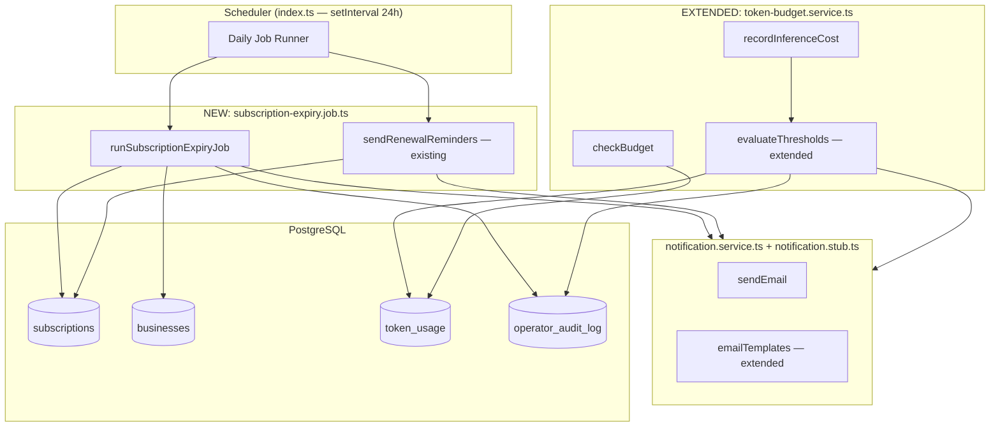

# Design Document

## Feature: Subscription Expiry and Token Deactivation

---

## Overview

This feature implements two independent automatic deactivation paths for the Augustus AI Sales Platform:

1. **Subscription expiry** — a daily cron job identifies active subscriptions whose `renewal_date` has passed, cancels them, suspends the associated business, sends a deactivation email, and writes an audit log entry. Reminder emails are sent at T-7 and T-1 days before expiry.

2. **Token budget exhaustion** — the existing `token-budget.service.ts` is extended to send a 100% exhaustion alert email (with a new `alert_100_sent` flag), write an audit log entry on suspension, and expose the `budgetExhausted` email template. The `checkBudget` / `recordInferenceCost` flow already handles 80% and 95% alerts and the `suspended` flag.

Both paths share the `notification.service.ts` (SendGrid) for email dispatch and `operator_audit_log` for auditability.

---

## Architecture



The scheduler in `index.ts` already runs a `runDailyJobs` function every 24 hours. The new `runSubscriptionExpiryJob` is added to that daily batch. No new scheduling infrastructure is needed.

---

## Components and Interfaces

### 1. `subscription-expiry.job.ts` (new file)

Location: `augustus/packages/api/src/modules/subscription/subscription-expiry.job.ts`

```typescript
export interface ExpiryJobResult {
  totalChecked: number;
  totalCancelled: number;
  totalRemindersSent: number;
  totalErrors: number;
  errors: Array<{ subscriptionId: string; businessId: string; error: string }>;
}

export async function runSubscriptionExpiryJob(): Promise<ExpiryJobResult>
```

Responsibilities:
- Query `subscriptions` where `status = 'active'` AND `renewal_date < CURRENT_DATE`
- For each expired subscription: atomically set `subscriptions.status = 'cancelled'` and `businesses.status = 'suspended'`, send expiry email, write audit log
- Continue processing remaining subscriptions if one fails (catch per-item errors)
- Log a structured summary at INFO level on completion

The reminder logic (`sendRenewalReminders`) already exists in `subscription.service.ts` and is called by the daily job runner. It will be called alongside `runSubscriptionExpiryJob` — no changes needed to the reminder logic itself, only the expiry email template and audit log are new.

### 2. `notification.service.ts` — new templates

Two new templates are added to the `emailTemplates` object:

```typescript
emailTemplates.subscriptionExpired(
  planName: string,
  expiryDate: string,
  reactivationUrl: string,
): { subject: string; html: string; text: string }

emailTemplates.budgetExhausted(
  planName: string,
  exhaustedAmountUsd: number,
  nextCycleDate: string,
): { subject: string; html: string; text: string }
```

### 3. `notification.stub.ts` — new send helpers

```typescript
export async function sendSubscriptionExpiredEmail(
  email: string,
  planName: string,
  expiryDate: Date,
): Promise<void>

export async function sendBudgetExhaustedEmail(
  email: string,
  planName: string,
  exhaustedAmountUsd: number,
  nextCycleDate: Date,
): Promise<void>
```

### 4. `token-budget.service.ts` — extensions

The `evaluateThresholds` function is extended to:
- Send the 100% exhaustion email via `sendBudgetExhaustedEmail` when `pct >= 1.0 && !usage.alert_100_sent`
- Set `alert_100_sent = TRUE` after successful send
- Write an `operator_audit_log` entry with `action_type = 'token_budget_exhausted'` when suspension occurs
- Log email failures at ERROR level without blocking cost recording

The `resetBillingCycle` / `runBillingCycleResetJob` functions already create new `token_usage` rows with `alert_80_sent = FALSE`, `alert_95_sent = FALSE`, `suspended = FALSE`. The new `alert_100_sent` column is added with `DEFAULT FALSE` so it is automatically reset on new rows.

The `upgradePlan` path in `subscription.service.ts` needs to call a new helper `reevaluateBudgetAfterUpgrade(businessId)` that re-checks accumulated cost against the new cap and clears `suspended` if the cost is now below the cap.

### 5. DB Migration `034_alert_100_sent.sql` (new)

```sql
ALTER TABLE token_usage
  ADD COLUMN IF NOT EXISTS alert_100_sent BOOLEAN NOT NULL DEFAULT FALSE;
```

---

## Data Models

### `token_usage` (after migration)

| Column | Type | Notes |
|---|---|---|
| `id` | UUID | PK |
| `business_id` | UUID | FK → businesses |
| `billing_cycle_start` | DATE | Composite unique with business_id |
| `accumulated_cost_usd` | NUMERIC(12,6) | Incremented atomically |
| `alert_80_sent` | BOOLEAN | Set after 80% email |
| `alert_95_sent` | BOOLEAN | Set after 95% email |
| `alert_100_sent` | BOOLEAN | **NEW** — set after 100% exhaustion email |
| `suspended` | BOOLEAN | Set when accumulated >= cap |
| `unavailability_msg_sent` | BOOLEAN | Existing — in-chat unavailability message |
| `updated_at` | TIMESTAMPTZ | |

### `subscriptions` (existing columns used)

| Column | Notes |
|---|---|
| `status` | `'active'` → `'cancelled'` on expiry |
| `renewal_date` | DATE — compared to `CURRENT_DATE` |
| `billing_cycle_start` | DATE — used for token cycle reset |
| `billing_months` | INT — used for renewal date calculation |
| `reminder_7_sent` | BOOLEAN — prevents duplicate 7-day reminders |
| `reminder_1_sent` | BOOLEAN — prevents duplicate 1-day reminders |
| `plan` | PlanTier — included in expiry email |

### `businesses` (existing columns used)

| Column | Notes |
|---|---|
| `status` | `'active'` → `'suspended'` on expiry or budget exhaustion |
| `email` | Recipient for all notification emails |

### `operator_audit_log` (existing table)

New `action_type` values written by this feature:

| `action_type` | Written by | `details` shape |
|---|---|---|
| `'subscription_expired'` | `runSubscriptionExpiryJob` | `{ subscriptionId, plan, expiryDate }` |
| `'token_budget_exhausted'` | `evaluateThresholds` | `{ billingCycleStart, accumulatedCostUsd, capUsd }` |

---

## Correctness Properties

*A property is a characteristic or behavior that should hold true across all valid executions of a system — essentially, a formal statement about what the system should do. Properties serve as the bridge between human-readable specifications and machine-verifiable correctness guarantees.*

### Property 1: Expiry job selects only active, past-due subscriptions

*For any* collection of subscription rows with varying `status` values and `renewal_date` values, the expiry job's query predicate SHALL return only those rows where `status = 'active'` AND `renewal_date < CURRENT_DATE`. Rows with `status = 'cancelled'`, `status = 'suspended'`, or `renewal_date >= CURRENT_DATE` SHALL NOT be included.

**Validates: Requirements 1.2**

### Property 2: Expiry job produces correct state transitions

*For any* expired subscription (status='active', renewal_date < today), after the expiry job processes it, `subscriptions.status` SHALL equal `'cancelled'` AND `businesses.status` SHALL equal `'suspended'`.

**Validates: Requirements 1.3**

### Property 3: Expiry job is idempotent

*For any* expired subscription, running `runSubscriptionExpiryJob` twice in the same day SHALL produce the same final state as running it once. The subscription SHALL be cancelled exactly once, and no duplicate emails or audit log entries SHALL be created.

**Validates: Requirements 1.7**

### Property 4: Expiry job continues on per-item failure

*For any* batch of N expired subscriptions where one throws a database error, the job SHALL still process the remaining N-1 subscriptions and the `ExpiryJobResult.totalErrors` count SHALL equal 1.

**Validates: Requirements 1.5**

### Property 5: Reminder flags prevent duplicate sends

*For any* subscription with `renewal_date = today + 7` and `reminder_7_sent = FALSE`, the job SHALL send the 7-day reminder and set `reminder_7_sent = TRUE`. On a subsequent run with `reminder_7_sent = TRUE`, no email SHALL be sent. The same invariant holds for the 1-day reminder and `reminder_1_sent`.

**Validates: Requirements 2.1, 2.2, 2.3, 2.4**

### Property 6: Subscription expiry email template contains required fields

*For any* plan name and expiry date, `emailTemplates.subscriptionExpired(planName, expiryDate, reactivationUrl)` SHALL produce output whose `html` and `text` fields contain the plan name, the expiry date string, and a reactivation call-to-action.

**Validates: Requirements 2.5, 2.7**

### Property 7: Budget alert flags prevent duplicate threshold emails

*For any* token budget cap and a sequence of cost increments that crosses the 80%, 95%, and 100% thresholds, each alert email SHALL be sent exactly once per billing cycle. After `alert_80_sent = TRUE`, no further 80% email is sent even if `recordInferenceCost` is called again above 80%.

**Validates: Requirements 3.1, 3.2, 3.3, 3.4**

### Property 8: Email failure does not block cost recording

*For any* inference cost increment where the notification service throws an error, `recordInferenceCost` SHALL still atomically increment `accumulated_cost_usd` and return the correct `BudgetStatus`. The email failure SHALL be logged at ERROR level but SHALL NOT propagate as an exception to the caller.

**Validates: Requirements 3.5, 6.4**

### Property 9: Budget exhausted email template contains required fields

*For any* plan name, exhausted amount, and next cycle date, `emailTemplates.budgetExhausted(planName, exhaustedAmountUsd, nextCycleDate)` SHALL produce output whose `html` and `text` fields contain the plan name, the exhausted amount, and the next billing cycle date.

**Validates: Requirements 3.6**

### Property 10: checkBudget returns allowed=false when accumulated >= cap

*For any* business where `accumulated_cost_usd >= token_budget_usd` (or `suspended = TRUE`) for the current billing cycle, `checkBudget` SHALL return `{ allowed: false, suspended: true }`. This holds regardless of the specific cap value or accumulated amount, as long as the condition is met.

**Validates: Requirements 4.1, 4.2**

### Property 11: Billing cycle reset clears all flags and counters

*For any* business after `resetBillingCycle` is called, the new `token_usage` row SHALL have `accumulated_cost_usd = 0`, `suspended = FALSE`, `alert_80_sent = FALSE`, `alert_95_sent = FALSE`, and `alert_100_sent = FALSE`.

**Validates: Requirements 4.3**

### Property 12: Upgrade re-evaluation lifts suspension when cost is below new cap

*For any* business with `suspended = TRUE` and `accumulated_cost_usd = A`, after upgrading to a plan with `token_budget_usd = C` where `A < C`, `reevaluateBudgetAfterUpgrade` SHALL set `suspended = FALSE` and `checkBudget` SHALL return `allowed = true`.

**Validates: Requirements 4.4**

### Property 13: Effective cap resolution respects override precedence

*For any* business, `getUsageAndCap` SHALL return `capUsd = hard_limit_usd` when a `business_token_overrides` row exists for that business, and `capUsd = plan_config.token_budget_usd` otherwise.

**Validates: Requirements 4.5**

### Property 14: Audit log entry is written for every automatic deactivation

*For any* subscription cancelled by the expiry job, an `operator_audit_log` row SHALL exist with `action_type = 'subscription_expired'`, `target_business_id` matching the business, and `details` containing `subscriptionId`, `plan`, and `expiryDate`. Similarly, for any business suspended by budget exhaustion, a row SHALL exist with `action_type = 'token_budget_exhausted'` and `details` containing `billingCycleStart`, `accumulatedCostUsd`, and `capUsd`.

**Validates: Requirements 6.1, 6.2**

---

## Error Handling

### Expiry job — per-subscription isolation

Each subscription is processed inside its own `try/catch`. A failure on one subscription (e.g., a DB deadlock or transient error) is caught, logged with `subscriptionId` and `businessId`, and the job continues to the next. The final summary log includes `totalErrors` and the error details array.

```
[SubscriptionExpiryJob] Error processing subscription <id> for business <id>: <message>
[SubscriptionExpiryJob] Run complete: checked=10, cancelled=8, reminders=2, errors=1
```

### Email failures — non-blocking

All email sends in both the expiry job and `evaluateThresholds` are wrapped in `try/catch`. On failure:
- The error is logged at ERROR level with `businessId`, the relevant threshold or event type, and the error message.
- The database state update (flag set, audit log) still proceeds — the flag is set regardless of email success to prevent infinite retry loops.
- The cost recording operation is never blocked.

### Transaction atomicity

The expiry job uses a `pool.connect()` / `BEGIN` / `COMMIT` / `ROLLBACK` pattern (matching the existing pattern in `subscription.service.ts`) to ensure `subscriptions.status` and `businesses.status` are updated atomically. If the transaction fails, neither update is applied.

### Idempotency

The expiry query filters `status = 'active'`, so already-cancelled subscriptions are never re-processed. The `alert_100_sent` flag and the existing `alert_80_sent` / `alert_95_sent` flags prevent duplicate emails. The `operator_audit_log` insert is unconditional (append-only), which is acceptable — duplicate audit entries on a retry are preferable to missing entries.

---

## Testing Strategy

### Unit tests (example-based)

- `emailTemplates.subscriptionExpired` — verify output contains plan name, expiry date, and CTA for a concrete example
- `emailTemplates.budgetExhausted` — verify output contains plan name, amount, and next cycle date
- `runSubscriptionExpiryJob` summary log — run with a known fixture set and assert the log fields
- Email failure path — mock `sendEmail` to throw, assert error is logged and job continues

### Property-based tests

The project uses TypeScript/Node. The recommended PBT library is **[fast-check](https://github.com/dubzzz/fast-check)**, which is idiomatic for TypeScript and requires no additional runtime dependencies beyond `npm install --save-dev fast-check`.

Each property test runs a minimum of **100 iterations**.

Tag format: `// Feature: subscription-expiry-and-token-deactivation, Property N: <property text>`

| Property | Test file | What varies |
|---|---|---|
| P1: Expiry query predicate | `subscription-expiry.job.test.ts` | status, renewal_date combinations |
| P2: State transitions | `subscription-expiry.job.test.ts` | subscription/business IDs, plan tiers |
| P3: Idempotence | `subscription-expiry.job.test.ts` | expired subscription sets |
| P4: Batch resilience | `subscription-expiry.job.test.ts` | batch size, failure position |
| P5: Reminder flag deduplication | `subscription-expiry.job.test.ts` | days-until-renewal, flag state |
| P6: Expiry email template | `notification.service.test.ts` | plan names, expiry dates |
| P7: Budget alert deduplication | `token-budget.service.test.ts` | cap values, cost increment sequences |
| P8: Email failure isolation | `token-budget.service.test.ts` | cost amounts, cap values |
| P9: Budget exhausted template | `notification.service.test.ts` | plan names, amounts, dates |
| P10: checkBudget enforcement | `token-budget.service.test.ts` | accumulated cost, cap pairs |
| P11: Billing cycle reset | `token-budget.service.test.ts` | business IDs, prior flag states |
| P12: Upgrade re-evaluation | `token-budget.service.test.ts` | accumulated cost, old/new cap pairs |
| P13: Cap resolution precedence | `token-budget.service.test.ts` | override presence/absence, plan tiers |
| P14: Audit log completeness | `subscription-expiry.job.test.ts`, `token-budget.service.test.ts` | subscription/business IDs, plan tiers, cost values |

Test files location: `augustus/packages/api/src/modules/subscription/__tests__/` and `augustus/packages/api/src/modules/token-budget/__tests__/`

### Integration considerations

- The expiry job and token budget service interact with PostgreSQL. Unit tests should mock `pool.query` to keep tests fast and deterministic.
- The `operator_audit_log` insert can be verified by asserting the mock was called with the correct arguments.
- End-to-end smoke test: verify the daily job runner in `index.ts` calls `runSubscriptionExpiryJob` (can be verified by checking the import and the `runDailyJobs` function body).
