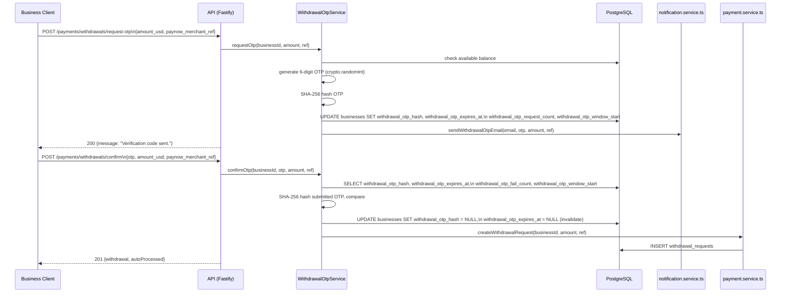

# Design Document — Withdrawal 2FA Email OTP

## Overview

This feature adds a two-step email OTP gate in front of the business-initiated withdrawal flow. The existing `POST /payments/withdrawals` endpoint is replaced by a two-step sequence:

1. `POST /payments/withdrawals/request-otp` — validates the request, generates a 6-digit OTP, stores its SHA-256 hash, and emails the code to the business owner.
2. `POST /payments/withdrawals/confirm` — verifies the submitted OTP against the stored hash and, on success, delegates to the existing `createWithdrawalRequest` logic.

The admin approval flow (`POST /admin/withdrawals/:id/approve`) is entirely unchanged.

The implementation is self-contained within the `packages/api` package. No changes are required to `packages/admin-dashboard`.

---

## Architecture



### Key Design Decisions

**Two-step flow over single-step**: The OTP is requested before the withdrawal parameters are locked in. This means the business can verify the amount and merchant ref in the email before submitting the OTP. The `amount_usd` and `paynow_merchant_ref` are re-submitted at confirmation time and re-validated — this prevents a TOCTOU attack where the context changes between request and confirm.

**OTP stored on `businesses` table**: The operator OTP pattern (migration `017_operator_otp_columns.sql`) already adds `otp_hash` and `otp_expires_at` to the `operators` table. We follow the same pattern for businesses, adding dedicated `withdrawal_otp_*` columns. This avoids a separate table join on every verification and keeps the OTP lifecycle tightly coupled to the business record.

**Rate limiting via DB columns, not Redis**: Redis is available but optional (the client has a `retryStrategy` that gives up after 3 attempts). Using DB columns for rate limit counters (`withdrawal_otp_request_count`, `withdrawal_otp_fail_count`, `withdrawal_otp_window_start`) avoids a hard dependency on Redis availability for a security-critical path. The counter is reset lazily when the window expires.

**No separate confirmation token**: The requirements mention a `Confirmation_Token` in the glossary but the acceptance criteria describe a direct two-step flow. The design omits the intermediate token to keep the surface area minimal — the OTP itself is the single-use credential.

---

## Components and Interfaces

### New: `WithdrawalOtpService` (`withdrawal-otp.service.ts`)

A new module at `packages/api/src/modules/payment/withdrawal-otp.service.ts` containing all OTP logic as pure-ish functions (DB calls isolated, hash/validation logic exportable for testing).

```typescript
// Exported pure helpers (testable without DB)
export function generateOtp(): string                          // crypto.randomInt → zero-padded 6-digit string
export function hashOtp(otp: string): string                   // SHA-256 hex digest
export function isOtpExpired(expiresAt: Date, now?: Date): boolean
export function computeOtpExpiry(from?: Date): Date            // from + 10 minutes
export function isValidOtpFormat(otp: string): boolean         // /^\d{6}$/
export function isValidAmount(amount: unknown): boolean        // number > 0
export function isValidMerchantRef(ref: unknown): boolean      // non-empty string after trim
export function isRateLimited(count: number, windowStart: Date, now?: Date): boolean
export function buildWithdrawalOtpEmail(
  otp: string, amountUsd: number, paynowMerchantRef: string
): { subject: string; html: string; text: string }

// DB-coupled service methods
export async function requestOtp(
  businessId: string, amountUsd: number, paynowMerchantRef: string
): Promise<void>

export async function confirmOtp(
  businessId: string, otp: string, amountUsd: number, paynowMerchantRef: string
): Promise<{ withdrawal: WithdrawalRequest; autoProcessed: boolean }>
```

### Modified: `payment.routes.ts`

Two new routes added; the existing `POST /payments/withdrawals` route is **kept** (backward compatibility — existing integrations are not broken, but the new two-step flow is the documented path):

```
POST /payments/withdrawals/request-otp   → withdrawalOtpService.requestOtp(...)
POST /payments/withdrawals/confirm       → withdrawalOtpService.confirmOtp(...)
```

Both routes require the `authenticate` middleware (business JWT).

### New: Migration `031_withdrawal_otp_columns.sql`

```sql
ALTER TABLE businesses
  ADD COLUMN IF NOT EXISTS withdrawal_otp_hash         VARCHAR(64),
  ADD COLUMN IF NOT EXISTS withdrawal_otp_expires_at   TIMESTAMPTZ,
  ADD COLUMN IF NOT EXISTS withdrawal_otp_request_count INT NOT NULL DEFAULT 0,
  ADD COLUMN IF NOT EXISTS withdrawal_otp_fail_count    INT NOT NULL DEFAULT 0,
  ADD COLUMN IF NOT EXISTS withdrawal_otp_window_start  TIMESTAMPTZ;

CREATE INDEX IF NOT EXISTS idx_businesses_withdrawal_otp_expires
  ON businesses(withdrawal_otp_expires_at)
  WHERE withdrawal_otp_expires_at IS NOT NULL;
```

### Unchanged

- `payment.service.ts` — `createWithdrawalRequest` is called by `confirmOtp` after successful verification; no changes to its signature or logic.
- `notification.service.ts` — `sendEmail` is called with the new OTP email template; no changes to the service itself.
- Admin dashboard — no changes.
- `POST /admin/withdrawals/:id/approve` — no changes.

---

## Data Models

### `businesses` table additions

| Column | Type | Nullable | Description |
|---|---|---|---|
| `withdrawal_otp_hash` | `VARCHAR(64)` | YES | SHA-256 hex digest of the current pending OTP |
| `withdrawal_otp_expires_at` | `TIMESTAMPTZ` | YES | Expiry time (generation time + 10 min) |
| `withdrawal_otp_request_count` | `INT NOT NULL DEFAULT 0` | NO | OTP request count within current window |
| `withdrawal_otp_fail_count` | `INT NOT NULL DEFAULT 0` | NO | Failed verification count within current window |
| `withdrawal_otp_window_start` | `TIMESTAMPTZ` | YES | Start of the current 15-minute rate-limit window |

All five columns are NULL / 0 when no OTP has been requested or after the window expires.

### OTP Lifecycle State Machine

```
[No OTP]
    │  POST /request-otp (valid, not rate-limited)
    ▼
[Pending OTP]  ──── POST /request-otp (replace) ──→ [Pending OTP] (new hash/expiry)
    │
    ├── POST /confirm (correct OTP, not expired) ──→ [No OTP] + withdrawal created
    ├── POST /confirm (wrong OTP, fail count < 3) ──→ [Pending OTP] (fail_count++)
    ├── POST /confirm (wrong OTP, fail count = 3) ──→ [Rate Limited]
    └── expiry passes ──→ treated as [No OTP] on next attempt (lazy cleanup)

[Rate Limited]
    └── window expires (15 min from window_start) ──→ [No OTP]
```

### Request / Response Shapes

**`POST /payments/withdrawals/request-otp`**
```
Request:  { amount_usd: number, paynow_merchant_ref: string }
Response 200: { message: "Verification code sent to your registered email." }
Response 400: { error: string }   // validation failure
Response 422: { error: string, availableBalance: number }  // insufficient balance
Response 429: { error: string, retryAfter: string }  // rate limited (ISO timestamp)
```

**`POST /payments/withdrawals/confirm`**
```
Request:  { otp: string, amount_usd: number, paynow_merchant_ref: string }
Response 201: { withdrawal: WithdrawalRequest, autoProcessed: boolean }
Response 400: { error: string }   // invalid OTP format
Response 401: { error: string }   // wrong OTP / expired / no pending OTP
Response 422: { error: string, availableBalance: number }  // balance check at confirm time
Response 429: { error: string, retryAfter: string }  // too many failed attempts
```

---

## Correctness Properties

*A property is a characteristic or behavior that should hold true across all valid executions of a system — essentially, a formal statement about what the system should do. Properties serve as the bridge between human-readable specifications and machine-verifiable correctness guarantees.*

### Property 1: OTP Generation Produces Valid 6-Digit Codes

*For any* call to `generateOtp()`, the result SHALL be a string of exactly 6 decimal digit characters, representing a value in the range 000000–999999.

**Validates: Requirements 1.1, 4.5**

---

### Property 2: SHA-256 Hash Round-Trip

*For any* 6-digit OTP string `otp`, `hashOtp(otp)` SHALL produce a deterministic 64-character hex string, and verifying `otp` against `hashOtp(otp)` SHALL always succeed. *For any* two distinct 6-digit strings `otp1 ≠ otp2`, `hashOtp(otp1) ≠ hashOtp(otp2)` (no collisions within the 6-digit domain). The stored hash SHALL never equal the plaintext OTP.

**Validates: Requirements 1.2, 2.1, 4.1, 4.6**

---

### Property 3: OTP Expiry Calculation

*For any* generation timestamp `t`, `computeOtpExpiry(t)` SHALL return a timestamp exactly 10 minutes after `t` (i.e., `expiry - t === 600_000 ms`).

**Validates: Requirements 1.3**

---

### Property 4: OTP Expiry Check

*For any* expiry timestamp `expiresAt` that is strictly before `now`, `isOtpExpired(expiresAt, now)` SHALL return `true`. *For any* `expiresAt` that is equal to or after `now`, it SHALL return `false`.

**Validates: Requirements 2.5, 4.4**

---

### Property 5: Withdrawal OTP Email Content Completeness

*For any* valid 6-digit OTP `otp`, positive `amountUsd`, and non-empty `paynowMerchantRef`, the email produced by `buildWithdrawalOtpEmail(otp, amountUsd, paynowMerchantRef)` SHALL:
- have the subject exactly `"Augustus — Withdrawal Verification Code"`,
- contain the OTP string in the body,
- contain the text `"10 minutes"` in the body,
- contain the formatted amount in the body,
- contain the merchant reference in the body,
- contain a security notice phrase (e.g., `"did not initiate"` or `"contact support"`) in the body.

**Validates: Requirements 3.1, 3.2, 3.3, 3.4, 3.5**

---

### Property 6: Amount Validation

*For any* value `amount` that is not a finite positive number (i.e., `amount <= 0`, `NaN`, `Infinity`, or non-numeric), `isValidAmount(amount)` SHALL return `false`. *For any* finite positive number, it SHALL return `true`.

**Validates: Requirements 1.6**

---

### Property 7: OTP Format Validation

*For any* string that does not match `/^\d{6}$/` (not exactly 6 decimal digits), `isValidOtpFormat(s)` SHALL return `false`. *For any* string that does match `/^\d{6}$/`, it SHALL return `true`.

**Validates: Requirements 2.7**

---

### Property 8: Rate Limit Window Check

*For any* request count `n > 3` within an active 15-minute window, `isRateLimited(n, windowStart, now)` SHALL return `true`. *For any* `n <= 3` within an active window, it SHALL return `false`. *For any* `windowStart` more than 15 minutes before `now` (window expired), `isRateLimited` SHALL return `false` regardless of `n`.

**Validates: Requirements 5.1, 5.2, 5.3**

---

## Error Handling

| Scenario | HTTP Status | Response Body |
|---|---|---|
| Missing / invalid `amount_usd` | 400 | `{ error: "amount_usd must be a positive number." }` |
| Missing / empty `paynow_merchant_ref` | 400 | `{ error: "paynow_merchant_ref is required." }` |
| Insufficient balance (request-otp) | 422 | `{ error: "Insufficient balance.", availableBalance: number }` |
| OTP request rate limit exceeded | 429 | `{ error: "Too many OTP requests. Try again after <ISO>.", retryAfter: string }` |
| Invalid OTP format (confirm) | 400 | `{ error: "otp must be a 6-digit numeric code." }` |
| No pending OTP | 401 | `{ error: "No pending verification. Please request a new code." }` |
| OTP expired | 401 | `{ error: "Verification code has expired. Please request a new one." }` |
| Wrong OTP | 401 | `{ error: "Invalid verification code." }` |
| Verification attempt rate limit exceeded | 429 | `{ error: "Too many failed attempts. Try again after <ISO>.", retryAfter: string }` |
| Insufficient balance (confirm) | 422 | `{ error: "Insufficient balance.", availableBalance: number }` — OTP is NOT invalidated |
| Email dispatch failure | 500 | `{ error: "Failed to send verification email. Please try again." }` |

**OTP invalidation on balance failure**: When `confirmOtp` reaches the balance check and it fails (HTTP 422), the OTP hash and expiry are left intact. This allows the business to correct the amount and retry without requesting a new OTP. The fail counter is not incremented for balance failures (it is only incremented for wrong OTP submissions).

**Atomicity**: The OTP invalidation and withdrawal creation happen in a single DB transaction. If `createWithdrawalRequest` throws after the OTP has been cleared, the transaction is rolled back and the OTP remains valid.

---

## Testing Strategy

### Unit Tests (example-based)

Located in `packages/api/src/modules/payment/__tests__/withdrawal-otp.test.ts`:

- OTP replacement: request OTP twice, verify the stored hash changes.
- OTP one-time use: verify OTP, then attempt to verify again — second attempt returns "No pending verification."
- Balance failure preserves OTP: confirm with amount > balance, verify OTP columns are unchanged.
- Response shape: successful confirm returns `{ withdrawal, autoProcessed }`.
- No-OTP confirm: attempt confirm without requesting — returns 401.

### Property-Based Tests (fast-check)

Located in `packages/api/src/modules/payment/__tests__/withdrawal-otp.properties.test.ts`.

Uses `fast-check` (already a project dependency). Each property test runs a minimum of **100 iterations**.

Tag format: `Feature: withdrawal-2fa-email-otp, Property {N}: {property_text}`

| Property | Test description |
|---|---|
| Property 1 | `generateOtp()` always returns a string matching `/^\d{6}$/` |
| Property 2 | `hashOtp(otp)` is deterministic; `hashOtp(otp1) !== hashOtp(otp2)` for `otp1 !== otp2`; hash is never equal to plaintext |
| Property 3 | `computeOtpExpiry(t)` always returns `t + 600_000 ms` |
| Property 4 | `isOtpExpired` returns `true` iff `expiresAt < now` |
| Property 5 | `buildWithdrawalOtpEmail` output always contains OTP, amount, ref, "10 minutes", security notice, and exact subject |
| Property 6 | `isValidAmount` returns `false` for non-positive / non-numeric; `true` for positive finite numbers |
| Property 7 | `isValidOtpFormat` returns `false` for non-6-digit strings; `true` for `/^\d{6}$/` strings |
| Property 8 | `isRateLimited` returns `true` for count > 3 in active window; `false` for count ≤ 3 or expired window |

### Integration / Smoke Tests

- Schema smoke test: verify `withdrawal_otp_hash`, `withdrawal_otp_expires_at`, `withdrawal_otp_request_count`, `withdrawal_otp_fail_count`, `withdrawal_otp_window_start` columns exist on `businesses`.
- Admin approval smoke test: existing `POST /admin/withdrawals/:id/approve` tests pass unchanged.
- End-to-end happy path: request-otp → confirm → withdrawal created (can be added to `packages/e2e/smoke/api.smoke.js`).
